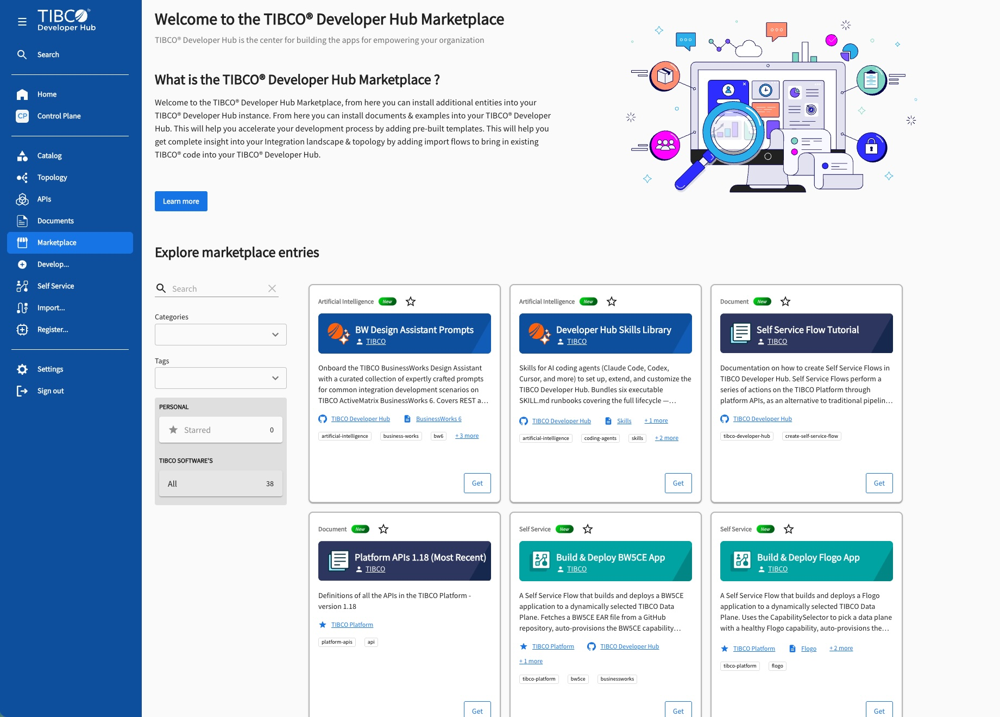

# TIBCO® Developer Hub Marketplace

> The content catalog behind the **Marketplace** in [TIBCO® Developer Hub](https://github.com/TIBCOSoftware/tibco-developer-hub).

TIBCO® Developer Hub is the center for building the apps that empower your organization. This repository holds the ready-to-install entries — templates, import flows, self-service flows, documentation, samples, and API definitions — that appear in your Developer Hub **Marketplace** and help you accelerate development, standardize best practices, and bring existing TIBCO assets into your Hub.



## What is this repository?

This repo is **content, not an application**. It contains the [Backstage](https://backstage.io/) catalog entities (YAML + Markdown) that the Developer Hub portal discovers over Git and renders in the Marketplace. There is no build, compile, or test step — the Developer Hub instance ingests these files directly.

It is one half of a pair:

| Repository | Purpose |
| --- | --- |
| **[tibco-developer-hub](https://github.com/TIBCOSoftware/tibco-developer-hub)** | The Developer Hub portal application (a Backstage monorepo). Deploy this to run your Hub. |
| **tibco-developer-hub-marketplace** _(this repo)_ | The Marketplace content the portal reads to populate its Marketplace, Import, Self Service, Documents, and APIs pages. |

To learn more about TIBCO Developer Hub and the Marketplace, see the [official documentation](https://docs.tibco.com/pub/platform-cp/latest/doc/html/Default.htm#Subsystems/platform-devhub/User-Guide/marketplace.htm).

## What's inside

All content lives under [`developer-hub-marketplace-content/`](developer-hub-marketplace-content/). Each immediate subdirectory is a self-contained marketplace contribution. The categories currently shipped include:

- **Platform APIs** (`tibco-platform-apis/`) — the full TIBCO Platform API definitions, versioned.
- **Import Flows** (`import-flows/`) — bring existing TIBCO assets (APIs, apps, servers) into your Hub catalog.
- **Self-Service Flows** (`self-service-flows/`) — one-click flows that build and deploy apps to a TIBCO Data Plane.
- **Templates & Samples** (`flogo-templates/`, `flogo-samples/`, `e-commerce-platform/`, `smart-routing/`, …) — pre-built scaffolder templates and reference architectures.
- **AI & Skills** (`flogo-ai-agents/`, `business-works-ai/`, `bw-ai-generator/`, `developer-hub-skills/`, `flogo-skills/`) — AI agents, prompt libraries, and skill libraries for coding agents.
- **Tutorials & Docs** (`developer-hub-tutorials/`, `business-works-articles/`) — TechDocs guides for using and extending the Hub.
- **Platform tooling** (`platform-cli/`, `platform-provisioner/`, `helm-charts/`, `tp-cicd-pipelines/`, `flogo-extensions/`, `flogo-extension-generators/`) — provisioning, CI/CD, and extension building blocks.

## Marketplace entry types

Every entry declares a `spec.type` that sets its category and where it surfaces in Developer Hub:

| Type | What it is |
| --- | --- |
| `document` | Documentation (TechDocs) — guides and reference material. |
| `template` | A Backstage scaffolder template that generates new projects. |
| `import-flow` | A flow that imports existing TIBCO assets into the catalog. |
| `self-service` | A build-and-deploy flow that provisions and runs an app. |
| `sample` | A sample application or reference architecture. |
| `artificial-intelligence` | AI/ML agents, prompt libraries, and coding-agent skills. |

## How it works

An entry becomes visible in the Marketplace when its `Template` carries the `devhub-marketplace` tag and a marketplace spec block. Developer Hub discovers each contribution through its `catalog-info.yaml`, which is typically a thin `kind: Location` that fans out to the real entity files:

```yaml
kind: Location
spec:
  targets:
    - ./self-service-build-deploy-flogo-app.yaml
    - ../tibco-self-service-group.yaml   # shared Group
```

The referenced files declare the actual `Template`, `Group`, `Component`, `API`, or `System` entities that Developer Hub renders.

## Using these entries

You don't clone this repo to use it — you consume it **from within TIBCO Developer Hub**:

1. Open your Developer Hub and go to the **Marketplace** page.
2. Browse or search the entries; filter by category or tag.
3. Click **Get** on an entry to install it into your Hub instance.

Once installed, entries appear on the relevant pages — templates under **Develop**, import flows under **Import**, self-service flows under **Self Service**, docs under **Documents**, and API definitions under **APIs**.

## Contributing

To add a new entry, mirror an existing sibling directory's layout rather than inventing structure:

```
developer-hub-marketplace-content/<your-entry>/
├── catalog-info.yaml        # kind: Location → targets
├── <entity>.yaml            # kind: Template / Component / API / …
├── skeleton/                # scaffolder-rendered files (Nunjucks), for templates
└── docs/ + mkdocs.yaml      # TechDocs, for documentation entries
```

Notes:
- `metadata.name` values are catalog-wide identifiers referenced by `owner`, `spec.targets`, and relative paths across files — renaming one means updating its references.
- Files under a `skeleton/` folder are rendered by the scaffolder; `${{ values.* }}` placeholders are substituted at scaffold time and should not be replaced with literal values.

See [`developer-hub-tutorials/create-marketplace-entry/`](developer-hub-marketplace-content/developer-hub-tutorials/create-marketplace-entry/) for the canonical walkthrough and the template that generates new entries.

## License

Content in this repository is provided under the [Apache License 2.0](LICENSE.TXT), the same license as [TIBCO® Developer Hub](https://github.com/TIBCOSoftware/tibco-developer-hub/blob/main/LICENSE.TXT).

---

Part of **[TIBCO® Developer Hub](https://github.com/TIBCOSoftware/tibco-developer-hub)** — the center for building the apps that empower your organization.
