# Banking Payments Integration Hub

This documentation describes a financial-services **payments integration landscape**: the system that
connects customer payment initiation, core banking validation, fraud and sanctions screening,
clearing, ledger posting and customer notification through TIBCO **EMS** and TIBCO integration
applications (BW6 / Flogo).

It is a sample topology used to demonstrate the TIBCO Developer Hub **Integration Topology** view
and **change-impact analysis** ("what breaks if a message changes?").

---

## What this system does

Payment requests enter through an API gateway and then move asynchronously through EMS topics and
queues. Each stage is mediated by a small TIBCO integration application that:

1. **Consumes** an inbound payment message or event,
2. **Transforms / enriches / routes** it while calling a banking backend, fraud engine or ledger, and
3. **Produces** the next contract for downstream teams.

The result is a loosely-coupled payment pipeline that runs end-to-end from ISO 20022 payment
initiation to fraud scoring, clearing, ledger posting and customer notification.

---

## How the catalog models it

| Real-world thing | Catalog kind | Notes |
|---|---|---|
| The payments landscape | `System` `payments-integration-hub` | groups everything |
| Business area | `Domain` `financial-services` | owns the system |
| A banking backend (core banking, card network, fraud, ledger, sanctions) | `Resource` (`type: banking-system`) | external; apps `dependsOn` it |
| The API gateway | `Resource` (`type: api-gateway`) | public ingress; payment gateway app `dependsOn` it |
| The EMS broker + each topic/queue | `Resource` (`message-broker` / `topic` / `queue`) | infrastructure; apps `dependsOn` it |
| A **message contract** (the XSD / JSON Schema on a destination) | `API` (`type: iso20022-message`) | apps `providesApis` / `consumesApis` it |
| A TIBCO integration app | `Component` (`type: service`) | declares all the edges |
| An owning team | `Group` | `spec.owner` of the entities it runs |

**Why messages are modelled as APIs:** modelling each message as a first-class `API` makes the
schema a node in the dependency graph. The Integration Topology and impact-analysis tooling traverse
catalog **relations**, so when a message schema changes, every component that `consumesApis` it shows
up as a direct-impact consumer (`apiConsumedBy`). A schema buried in a doc or attached to the queue
Resource would be invisible to that traversal.

---

## Using this for impact analysis

To see the tooling in action, change a field in a message schema (e.g. add a `required` property to
`pacs008-credit-transfer-msg` in `messages.yaml`) and run the **impact-analysis** workflow on that
message. Because `pacs008-credit-transfer-msg` is consumed by both `fraud-scoring-flogo` and
`clearing-orchestrator-bw6`, the analysis will flag multiple direct consumers and show which teams
need to coordinate before the contract can change.

A second useful test is `fraud-score-msg`: it is owned by the fraud/risk team but consumed by the
payments engineering clearing app, so the report highlights a cross-team dependency boundary.
