# Patient Data Exchange

This documentation describes a healthcare **patient data exchange**: the system that connects an
EHR, laboratory system, master patient index, consent service and billing platform through TIBCO
**EMS**, a FHIR API gateway and TIBCO integration applications (BW6 / Flogo).

It is a sample topology used to demonstrate the TIBCO Developer Hub **Integration Topology** view
and **change-impact analysis** ("what breaks if a FHIR contract changes?").

---

## What this system does

Patient demographics and encounters originate in the EHR as HL7 v2 ADT messages. Lab results arrive
from the LIS as HL7 v2 ORU messages. The systems do not talk to each other directly. Instead, every
cross-system exchange is brokered asynchronously over **TIBCO EMS** topics and queues, with each
TIBCO integration application responsible for a small step:

1. **Consumes** an inbound message from EMS,
2. **Transforms / enriches / validates** it against clinical, consent or identity services, and
3. **Produces** a FHIR-aligned message for the next downstream consumers.

The result is a loosely-coupled patient data pipeline that runs from HL7 ADT and lab events to FHIR
Patient and Observation resources, consent enforcement, MPI updates and billing claim summaries.

---

## How the catalog models it

| Real-world thing | Catalog kind | Notes |
|---|---|---|
| The integration landscape | `System` `patient-data-exchange` | groups everything |
| Business area | `Domain` `healthcare` | owns the system |
| A backend system (Epic, LIS, billing, consent, MPI) | `Resource` (`type: clinical-system`) | external; apps `dependsOn` it |
| The EMS broker + each topic/queue | `Resource` (`message-broker` / `topic` / `queue`) | infrastructure; apps `dependsOn` it |
| The FHIR API gateway | `Resource` (`type: api-gateway`) | secure FHIR edge used by the bridge |
| A **message contract** (HL7 v2 sample / FHIR JSON Schema on a destination) | `API` (`type: hl7-message` / `fhir-resource`) | apps `providesApis` / `consumesApis` it |
| A TIBCO integration app | `Component` (`type: service`) | declares all the edges |
| An owning team | `Group` | `spec.owner` of the entities it runs |

**Why messages are modelled as APIs:** modelling each message as a first-class `API` makes the
schema a node in the dependency graph. The Integration Topology and impact-analysis tooling traverse
catalog **relations**, so when a message schema changes, every component that `consumesApis` it shows
up as a direct-impact consumer (`apiConsumedBy`). A schema buried in a doc or attached to the queue
Resource would be invisible to that traversal.

---

## Using this for impact analysis

To see the tooling in action, change a field in a FHIR schema (for example, add `address` to the
`required` array in `fhir-patient-msg` in `messages.yaml`) and run the **impact-analysis** workflow
on that message. Because `fhir-patient-msg` is consumed by two apps owned by **different teams**
(`patient-index-flogo` / patient index and `consent-gateway-flogo` / consent), the analysis will flag
both as directly impacted and surface the cross-team coordination needed.

This is the healthcare version of the classic "what breaks if we add a required FHIR field?" review:
clinical integration may publish the new field, but the MPI matching logic, consent enforcement and
any downstream PHI handling must all be checked before the contract is made stricter.
