# Claims Processing Hub

This documentation describes an insurer's **claims-processing orchestration**: the system that
connects first notice of loss (FNOL) intake, policy coverage checks, underwriting decisions, fraud
screening, document handling and payout handoff through a set of TIBCO integration applications
(BW6 / Flogo) and TIBCO **EMS** message contracts.

It is a sample topology used to demonstrate the TIBCO Developer Hub **Integration Topology** view
and **change-impact analysis** ("what breaks if a message changes?").

---

## What this system does

A claim moves through several teams and systems before payment. The backend systems do not call each
other directly. Instead, every handoff is brokered asynchronously over **TIBCO EMS** topics and
queues, and each exchange is mediated by a small TIBCO integration application that:

1. **Consumes** an inbound claim message from an EMS destination,
2. **Transforms / enriches / orchestrates** it by calling a backend system, and
3. **Produces** the next claim message for the downstream team.

The result is a loosely-coupled orchestration that runs from FNOL intake through underwriting,
document collection, assessment and payout.

---

## How the catalog models it

| Real-world thing | Catalog kind | Notes |
|---|---|---|
| The integration landscape | `System` `claims-processing-hub` | groups the claims orchestration |
| Business area | `Domain` `insurance` | owns the claims-processing system |
| A backend system | `Resource` (`policy-system`, `decision-engine`, `document-system`, `payment-system`, `fraud-system`) | external systems; apps `dependsOn` them |
| The EMS broker + each topic/queue | `Resource` (`message-broker` / `topic` / `queue`) | infrastructure; apps `dependsOn` it |
| A **message contract** | `API` (`type: claims-message`) | apps `providesApis` / `consumesApis` it |
| A TIBCO integration app | `Component` (`type: service`) | declares all topology and impact-analysis edges |
| An owning team | `Group` | `spec.owner` of the entities it runs |

**Why messages are modelled as APIs:** modelling each message as a first-class `API` makes the schema
a node in the dependency graph. The Integration Topology and impact-analysis tooling traverse catalog
**relations**, so when a message schema changes, every component that `consumesApis` it shows up as a
direct-impact consumer (`apiConsumedBy`). A schema buried in a doc or attached to the queue Resource
would be invisible to that traversal.

---

## Using this for impact analysis

To see the tooling in action, change a field in a message schema (for example, add a new `required`
property to `claim-assessment-msg` in `messages.yaml`) and run the **impact-analysis** workflow on
that message. Because `claim-assessment-msg` is consumed by both `payout-service-bw6` (Payments) and
`document-processor-flogo` (Documents), the analysis will flag both teams as directly impacted and
surface the coordination needed before the assessment contract can change.
