# Architecture & Flows

The network is an **event pipeline**. Each TIBCO integration app sits between EMS destinations and an
SAP backend, consuming one message and producing the next. This page walks the pipeline end-to-end
and calls out the dependency edges that matter for change management.

## The relation model

Every edge in the topology comes from a **Component** declaration:

- `consumesApis` / `providesApis` → contract (message) edges. These create `apiConsumedBy` /
  `apiProvidedBy` relations on the message `API`, which is what impact analysis reads.
- `dependsOn` → infrastructure edges to the EMS broker, an EMS destination, and/or an SAP backend.

So each app is connected to the graph **twice**: once by the *contract* it carries (the message API)
and once by the *infrastructure* it runs on (the queue/topic Resource + SAP Resource).

## End-to-end pipeline

| # | Stage | App | Reads | Writes | SAP |
|---|---|---|---|---|---|
| 1 | Order intake | `order-intake-bw6` | `sales-order-msg`, `material-master-msg` | `production-order-msg` | S/4HANA |
| 2 | Production | `production-orchestrator-bw6` | `production-order-msg` | `goods-movement-msg` | MES |
| 3a | Inventory | `inventory-updater-flogo` | `goods-movement-msg`, `material-master-msg` | `inventory-update-msg` | EWM |
| 3b | Quality | `quality-gateway-flogo` | `goods-movement-msg` | `quality-inspection-msg` | MES |
| 4a | Shipping | `shipment-dispatcher-bw6` | `inventory-update-msg` | `shipment-dispatch-msg` | EWM |
| 4b | Procurement | `procurement-bridge-bw6` | `inventory-update-msg` | `purchase-order-msg` | Ariba |
| — | Master data | `material-master-sync-bw6` | — | `material-master-msg` | S/4HANA, PLM |

### Flow narrative

1. **Order intake.** A sales order (`sales-order-msg`, IDoc ORDERS05) arrives from **S/4HANA** on
   `q.sales-order.inbound`. `order-intake-bw6` validates it against current material master
   (`material-master-msg`) and publishes a `production-order-msg` to `t.production-order.created`.
2. **Production.** `production-orchestrator-bw6` picks up the production order, drives the build in
   **SAP MES**, and publishes a `goods-movement-msg` to `t.goods-movement.posted` each time stock
   moves (issue of components, receipt of finished goods).
3. **Fan-out on goods movement.** Two apps subscribe to `goods-movement-msg`:
    - `inventory-updater-flogo` updates stock in **SAP EWM** and publishes `inventory-update-msg`.
    - `quality-gateway-flogo` runs inspections in **SAP MES** and publishes `quality-inspection-msg`.
4. **Fan-out on inventory update.** Two apps subscribe to `inventory-update-msg`:
    - `shipment-dispatcher-bw6` releases shipments from **EWM** and publishes `shipment-dispatch-msg`.
    - `procurement-bridge-bw6` raises purchase orders in **SAP Ariba** when stock falls below the
      reorder point and publishes `purchase-order-msg`.
5. **Master data** is kept current independently: `material-master-sync-bw6` mirrors material master
   between **S/4HANA** and **PLM** and republishes `material-master-msg` for everyone who needs it.

## Cross-team ripple points

These are the high-value findings for impact analysis — a message owned by one team but consumed by
**another** team's app. Changing one of these contracts forces cross-team coordination:

| Message | Owner team | Consumed by (team) | Ripple |
|---|---|---|---|
| `material-master-msg` | Master Data | `order-intake-bw6` (Order Mgmt), `inventory-updater-flogo` (Logistics) | Master Data → Order Mgmt + Logistics |
| `goods-movement-msg` | Production | `inventory-updater-flogo` (Logistics), `quality-gateway-flogo` (Production) | Production → Logistics |
| `inventory-update-msg` | Logistics | `shipment-dispatcher-bw6` (Logistics), `procurement-bridge-bw6` (Procurement) | Logistics → Procurement |

## Failure & ordering notes

- All exchanges are **asynchronous**; apps are decoupled by the EMS broker. An app being down delays
  but does not lose messages (queues persist; durable topic subscriptions where required).
- `t.*` destinations are **topics** (pub/sub, multiple subscribers — note the fan-outs above).
- `q.*` destinations are **queues** (point-to-point, single logical consumer / inbound from SAP).
- Schema changes should be **additive** wherever possible; see each message in the
  [Message Catalog](messages.md) for required vs optional fields.
