# Impact Analysis — Restricting `OrderType` in `sales-order-msg`

> **Subject:** `sales-order-msg` (SAP IDoc ORDERS05 contract) · **System:** `sap-integration-hub`
> **Proposed change:** `HeaderType/OrderType` from open `xsd:string` → restricted `xsd:enumeration`
> (`STANDARD | RUSH | RETURN | SAMPLE | CREDIT`). **Restricting / breaking.**
> **Source:** live Developer Hub catalog graph (via the `dev-hub` MCP server), 2026-06-03.
>
> This is a worked example of a change-impact assessment. The full version with Mermaid diagrams
> lives in the repo at `impact_analysis/sales-order-msg-impact-analysis.md`.

## Executive summary

`sales-order-msg` is the **inbound front door** of the network: a production EMS contract owned by
**Order Management**, consumed by exactly one app (`order-intake-bw6`) and **emitted by SAP S/4HANA**
(the message has *no internal provider* — the producer is the external `sap-s4hana` resource reached via
the consumer's `dependsOn`).

The structural blast radius is **small** — one consumer and one source — but the **sharpest risk is at
the source and crosses teams**: a restricting enumeration authored by **Order Management** is
unenforceable unless **Master Data** (who owns `sap-s4hana`) guarantees S/4HANA only ever emits
`OrderType` values inside the new set. SAP order types are usually short customizing codes
(`OR`, `TA`, `RE`…), so if the enum is written with business labels that don't match the wire values,
**every inbound order fails validation at intake and nothing flows downstream.**

`OrderType` does **not** propagate: `order-intake-bw6` maps the order into `production-order-msg`, whose
schema has **no OrderType field**. Production is therefore only *conditionally* affected.

| Tier | Count | Entities |
|------|-------|----------|
| 🔴 Direct / High | 3 | `sales-order-msg` (subject), `order-intake-bw6`, `sap-s4hana` |
| 🟠 Conditional | 1 | `production-orchestrator-bw6` |
| 🟢 Not impacted | rest | material-master flow, production/quality/inventory/shipping/procurement, EMS transport |

## Blast-radius (data flow of the `OrderType` field)

### Layered change-propagation

### Ownership & coordination

## Detailed impact

### 🔴 `sales-order-msg` — the contract (Order Management)
The XSD gains an `xsd:restriction` with a fixed `xsd:enumeration` on `HeaderType/OrderType`. This narrows
the accepted value space → **breaking** for anyone not already inside it.

### 🔴 `order-intake-bw6` — Component · BW6 · Order Management
The only consumer (`apiConsumedBy`). Receives the ORDERS05 off `q.sales-order.inbound` and parses
`OrderType`. Must validate against the enum, decide how to treat out-of-enum values (reject / dead-letter
/ map), and update any branching keyed on `OrderType`. **Where a non-conforming value hard-fails.**

### 🔴 `sap-s4hana` — Resource · sap-system · Master Data
The actual **emitter** of `OrderType` (`order-intake-bw6 dependsOn sap-s4hana`; the subject has no
internal provider). The restriction is only safe if S/4HANA's outbound customizing emits exclusively
values in the enum. **Make-or-break, and owned by a different team than the contract.**

### 🟠 `production-orchestrator-bw6` — Component · BW6 · Production
Downstream via `production-order-msg`, which carries **no** `OrderType`. Impacted only if the enum
**excludes a value S/4HANA currently sends** (those orders fail at intake → fewer production orders), or
if `order-intake-bw6` derives production behaviour from `OrderType`. **Review before dropping any
existing value.**

### 🟢 Not impacted
`material-master-msg` / `material-master-sync-bw6` (the other input, no `OrderType`); the EMS transport
(`q.sales-order.inbound`, `manufacturing-ems-server`); and the entire downstream chain (goods-movement, inventory,
quality, shipping, procurement) — `OrderType` never reaches them.

## Ownership & coordination

| Team | Owns (here) | Role in this change |
|---|---|---|
| **Order Management** | `sales-order-msg`, `order-intake-bw6` | Authors & consumes the change |
| **Master Data** | `sap-s4hana` | **Blocking** — must constrain/agree what S/4HANA emits |
| **Production** | `production-orchestrator-bw6` | Review only if an in-use OrderType is dropped |
| Integration Platform | queue / broker | FYI — dead-letter / queue config |

**The non-obvious finding:** the change is authored and consumed within **Order Management**, but it can
only be made safe by **Master Data**, who owns the S/4HANA emitter. A contract restriction with no control
over the source is a guaranteed production incident.

## Risk & recommendations

| Aspect | Assessment |
|---|---|
| Change class | **Restricting / breaking** (value-space narrowing) |
| Lifecycle | `production` front-door contract → high bar |
| Structural radius | Small (1 consumer + 1 source) |
| Operational radius | **High** — a rejection at intake halts the order's whole pipeline |
| Primary failure mode | S/4HANA emits a value outside the enum (likely if labels ≠ SAP codes) |

**Pre-merge checklist**

1. **Derive the enum from real data** — export the distinct `OrderType` values S/4HANA actually emits;
   build the enumeration from those, not assumed labels.
2. **Code vs label** — if using business names, add a code→label mapping in `order-intake-bw6`.
3. **Version the contract** — introduce the restricted variant deliberately (schema version / transition
   window), don't silently tighten a production schema.
4. **Fail soft** — `order-intake-bw6` should validate-and-route (dead-letter unknown `OrderType`) during
   transition, not hard-fail.
5. **Contract tests** — one per enum value plus a rejected value.
6. **Deploy order** — constrain S/4HANA output (or ship the mapping) **before/with** the restricted schema.
7. **Notify:** Order Management (required), **Master Data (required, blocking)**, Production (if a used
   value is dropped), Integration Platform (FYI).
