# SAP ↔ TIBCO EMS Integration Network

This documentation describes a manufacturer's **integration landscape**: the system that connects
the company's **SAP backends** to its TIBCO **EMS** messaging fabric through a set of TIBCO
integration applications (BW6 / Flogo), and the **message contracts** that flow between them.

It is a sample topology used to demonstrate the TIBCO Developer Hub **Integration Topology** view
and **change-impact analysis** ("what breaks if a message changes?").

---

## What this system does

Orders, material data, production, inventory, shipping and procurement all originate in or
terminate at SAP. None of those SAP systems talk to each other directly. Instead, every cross-system
exchange is brokered asynchronously over **TIBCO EMS** topics and queues, and each exchange is
mediated by a small TIBCO integration application that:

1. **Consumes** an inbound message (from SAP or another app) off an EMS destination,
2. **Transforms / enriches / routes** it (often calling an SAP backend), and
3. **Produces** an outbound message onto another EMS destination.

The result is a loosely-coupled event pipeline that runs end-to-end from a customer sales order to
production, quality, inventory, shipping and replenishment.

See **[Architecture & Flows](architecture.md)** for the full narrative and the cross-team
dependencies.

---

## How the catalog models it

| Real-world thing | Catalog kind | Notes |
|---|---|---|
| The integration landscape | `System` `sap-integration-hub` | groups everything |
| Business area | `Domain` `manufacturing` | owns the system |
| An SAP backend (S/4HANA, MES, EWM, Ariba, PLM) | `Resource` (`type: sap-system`) | external; apps `dependsOn` it |
| The EMS broker + each topic/queue | `Resource` (`message-broker` / `topic` / `queue`) | infrastructure; apps `dependsOn` it |
| A **message contract** (the XSD / JSON Schema on a destination) | `API` (`type: ems-message`) | apps `providesApis` / `consumesApis` it |
| A TIBCO integration app | `Component` (`type: service`) | declares all the edges |
| An owning team | `Group` | `spec.owner` of the entities it runs |

**Why messages are modelled as APIs:** modelling each message as a first-class `API` makes the
schema a node in the dependency graph. The Integration Topology and impact-analysis tooling traverse
catalog **relations**, so when a message schema changes, every component that `consumesApis` it shows
up as a direct-impact consumer (`apiConsumedBy`). A schema buried in a doc or attached to the queue
Resource would be invisible to that traversal.

---

## Documentation map

- **[Architecture & Flows](architecture.md)** — the end-to-end pipeline, per-flow narrative, and the
  cross-team ripple points.
- **[Message Catalog](messages.md)** — every message contract, its EMS destination, producer/consumers,
  and the **full XSD / JSON Schema**.
- **[Integration Apps](integration-apps.md)** — what each BW6 / Flogo app does, its inputs/outputs
  and dependencies.
- **[SAP Backends](sap-backends.md)** — the five SAP systems and what they provide.
- **[EMS Destinations](ems-destinations.md)** — the broker and every topic/queue.
- **[Teams & Ownership](teams.md)** — who owns what, and the coordination boundaries.

---

## Using this for impact analysis

To see the tooling in action, change a field in a message schema (e.g. add a `required` property to
`goods-movement-msg` in `messages.yaml`) and run the **impact-analysis** workflow on that message.
Because `goods-movement-msg` is consumed by two apps owned by **different teams**
(`inventory-updater-flogo` / logistics and `quality-gateway-flogo` / production), the analysis will
flag both as directly impacted and surface the cross-team coordination needed.
