# Smart Grid Telemetry

This documentation describes an energy & utilities **edge-to-cloud IoT telemetry pipeline**: the
system that connects a field **smart meter fleet** to **TIBCO EMS** through TIBCO
integration applications (Flogo Edge / Flogo / BW6), and the **message contracts**
that flow between telemetry, analytics, outage management and billing teams.

It is a sample topology used to demonstrate the TIBCO Developer Hub **Integration Topology** view
and **change-impact analysis** ("what breaks if a message changes?").

---

## What this system does

Smart meters publish interval readings and quality indicators from the grid edge. Those readings are
accepted by an MQTT broker, normalized by a Flogo EDGE app, and then placed onto the cloud messaging
fabric. From there, multiple applications consume the same meter-reading contract for different
business outcomes:

1. **Telemetry normalization** enriches readings with SCADA and historian context and publishes grid events.
2. **Anomaly detection** correlates readings and grid events to publish probable outage alerts.
3. **Outage management** opens operational incidents and correlates them with GIS and SCADA assets.
4. **Demand forecasting** produces short-horizon load forecasts from meter readings and historian trends.
5. **Usage billing** aggregates readings into billable usage totals for the billing platform.

---

## How the catalog models it

| Real-world thing | Catalog kind | Notes |
|---|---|---|
| The telemetry pipeline | `System` `smart-grid-telemetry-system` | groups everything |
| Business area | `Domain` `energy-utilities` | owns the system |
| Smart meters and utility backends | `Resource` (`device-fleet`, `scada-system`, `historian`, `gis-system`, `grid-billing-system`) | external; apps `dependsOn` them |
| The MQTT broker, EMS broker and each topic/queue | `Resource` (`message-broker` / `topic` / `queue`) | infrastructure; apps `dependsOn` it |
| A **message contract** (the JSON Schema on a destination) | `API` (`type: iot-message`) | apps `providesApis` / `consumesApis` it |
| A TIBCO integration app | `Component` (`type: service`) | declares all the edges |
| An owning team | `Group` | `spec.owner` of the entities it runs |

**Why messages are modelled as APIs:** modelling each message as a first-class `API` makes the
schema a node in the dependency graph. The Integration Topology and impact-analysis tooling traverse
catalog **relations**, so when a message schema changes, every component that `consumesApis` it shows
up as a direct-impact consumer (`apiConsumedBy`). A schema buried in a doc or attached to the queue
Resource would be invisible to that traversal.

---

## Using this for impact analysis

To see the tooling in action, change a field in a message schema (for example, add a required
`phase` property to `meter-reading-msg` in `messages.yaml`) and run the **impact-analysis** workflow
on that message.

Because `meter-reading-msg` is consumed by apps owned by **different teams** —
`telemetry-normalizer-bw6` (telemetry), `anomaly-detector-flogo` (analytics),
`demand-forecaster-flogo` (analytics) and `usage-billing-bw6` (billing) — the analysis will flag
multiple direct consumers and surface the cross-team coordination needed before the schema can be
changed safely.
