# Telecom Order-to-Activate

This documentation describes a telecommunications **Order-to-Activate** integration landscape: the
system that connects commercial **BSS** order capture to **OSS** service orchestration, resource
provisioning, network activation and billing through TMF Open API-inspired message contracts.

It is a sample topology used to demonstrate the TIBCO Developer Hub **Integration Topology** view
and deep **change-impact analysis** across a long, multi-hop dependency chain.

---

## What this system does

A customer product order enters through a TMF API gateway. It is not fulfilled by one monolithic
application. Instead, a chain of TIBCO integration apps decomposes the order step by step:

1. **Product order capture** validates the customer and product catalog context.
2. **Service orchestration** turns commercial products into service orders.
3. **Resource provisioning** maps services to network resources.
4. **Network activation** executes the activation and emits completion.
5. **Billing activation** starts billing when the order has completed.

Each hop is mediated by a message contract modelled as a catalog `API`, and each app declares the
messages it `consumesApis` and `providesApis`. That makes the schema itself visible in the topology
and traceable by impact analysis.

---

## How the catalog models it

| Real-world thing | Catalog kind | Notes |
|---|---|---|
| The OSS/BSS integration landscape | `System` `order-to-activate-hub` | groups the full topology |
| Business vertical | `Domain` `telecommunications` | owns the system context |
| CRM, product catalog, OSS inventory, provisioning and billing | `Resource` | external backend systems; apps `dependsOn` them |
| The EMS broker + each topic/queue | `Resource` (`message-broker` / `topic` / `queue`) | infrastructure; apps `dependsOn` it; destinations use `dependencyOf` to link to message APIs |
| A TMF / activation message contract | `API` (`type: tmf-message`) | inline JSON Schema draft-07; apps `providesApis` / `consumesApis` it |
| A TIBCO integration app | `Component` (`type: service`) | declares the long dependency chain |
| An owning team | `Group` | `spec.owner` of the entities it runs |

**Why messages are modelled as APIs:** modelling each message as a first-class `API` makes the
schema a node in the dependency graph. The Integration Topology and impact-analysis tooling traverse
catalog **relations**, so when a message schema changes, every component that `consumesApis` it shows
up as a direct-impact consumer (`apiConsumedBy`).

---

## Using this for impact analysis

To see deep impact analysis in action, change a field in `tmf622-product-order-msg` in
`messages.yaml` — for example, add a new required product characteristic or tighten the allowed
`state` values — and run the impact-analysis workflow on that message.

The direct impact is `order-capture-bw6`, but the dependency chain does not stop there. That app
produces `tmf641-service-order-msg`, which feeds `service-orchestrator-bw6`; the orchestrator
produces `tmf652-resource-order-msg`, which feeds `resource-provisioner-flogo`; provisioning produces
`activation-request-msg`, which feeds `activation-gateway-bw6`; and activation produces
`order-completion-msg`, which feeds `billing-activation-flogo`.

The result is a realistic multi-team ripple:

| Starting change | Direct consumer | Downstream chain |
|---|---|---|
| `tmf622-product-order-msg` | `order-capture-bw6` | service orchestration → resource provisioning → network activation → billing activation |
