# Data Lineage — message `inventory-update-msg`

| | |
|---|---|
| **Subject** | `api:default/inventory-update-msg` (`ems-message`, JSON Schema, 9 fields) |
| **Direction** | Both — full provenance and reach |
| **System** | `sap-integration-hub` · **Owner**: `group:logistics-team` · **Lifecycle**: production |
| **Date** | 2026-07-29 · **Data source**: catalog REST API |

## Summary

`inventory-update-msg` sits at the **centre of gravity of the landscape**: it is 4 hops downstream
of SAP S/4HANA and 2 hops upstream of both SAP Ariba and SAP EWM. Every other contract is either
its ancestor or its descendant.

```
SAP S/4HANA ─→ sales-order-msg ─→ order-intake-bw6 ─→ production-order-msg
  ─→ production-orchestrator-bw6 (SAP MES) ─→ goods-movement-msg
  ─→ inventory-updater-flogo (SAP EWM) ─→ ** inventory-update-msg **
  ─┬─→ procurement-bridge-bw6 (SAP Ariba) ─→ purchase-order-msg
   └─→ shipment-dispatcher-bw6 (SAP EWM)  ─→ shipment-dispatch-msg
```

| Metric | Value |
|---|---|
| Upstream hops to origin | 4 |
| Downstream hops to sink | 2 |
| Direct inputs | 2 contracts — `goods-movement-msg`, `material-master-msg` |
| Direct consumers | 2 components, **2 different teams** |
| Systems of record on the path | 5 |
| Teams crossed end to end | 5 |
| Fields that survive to a sink | 2 of 9 |

**Only 2 of its 9 fields travel any further.** `materialNumber` and (as a renamed derivative)
`plant` reach the outbound IDocs; the other seven — including the entire reorder signal — are
*consumed as decisions* rather than carried. That is the useful insight: this contract is a
**decision boundary**, not a pass-through.

## Confidence legend

| Tier | Meaning |
|---|---|
| 🟢 Carried | Same normalised name and type on both sides |
| 🔵 Renamed / Originates | Carried with a spelling change, or created by the component |
| 🟡 Derived | Transformation inferred, inside the app |
| ⚪ Dropped | Upstream carries it, downstream does not |

## End-to-end flow



The contract crosses the **JSON↔XSD boundary twice**: it is JSON Schema, fed partly by the XSD
`material-master-msg`, and feeds two XSD IDoc contracts. Both boundaries are hand-written mappings.

## Field-level provenance and reach



### Where each field comes from

| Field | Type | Req | Origin | Tier |
|---|---|---|---|---|
| `materialNumber` | string | ✔ | `goods-movement-msg.materialNumber`; also `material-master-msg.MaterialNumber` | 🟢 Carried |
| `plant` | string | ✔ | `goods-movement-msg.plant` | 🟢 Carried |
| `storageLocation` | string | | `goods-movement-msg.storageLocation` | 🟢 Carried |
| `unit` | string | ✔ | `goods-movement-msg.unit`; canonically `material-master-msg.BaseUnit` | 🟢 Carried |
| `availableQuantity` | number | ✔ | Aggregated from `goods-movement-msg.quantity` + SAP EWM state | 🟡 **Derived** |
| `reservedQuantity` | number | | **No upstream field** — SAP EWM or never populated | 🔵 Originates |
| `reorderPoint` | number | | No upstream carrier; likely `material-master-msg.Plants.SafetyStock` or SAP EWM | 🔵 Originates |
| `belowReorderPoint` | boolean | | Computed inside `inventory-updater-flogo` | 🔵 Originates |
| `asOf` | date-time | ✔ | Emit timestamp | 🔵 Originates |

Four of nine fields **originate at this component** — this contract creates as much as it forwards.

### Where each field goes

| Field | `purchase-order-msg` (Ariba) | `shipment-dispatch-msg` (EWM) |
|---|---|---|
| `materialNumber` | 🔵 `Items.MaterialNumber` | 🔵 `Packages.MaterialNumber` |
| `plant` | 🔵 `Items.Plant` | 🔵 `ShipFromPlant` |
| `unit` | 🔵 `Items.Unit` | ⚪ dropped |
| `availableQuantity` | 🟡 drives `Items.Quantity` (reorder formula) | 🟡 drives `Packages.Quantity` (packing) |
| `belowReorderPoint` | 🟡 **the trigger** — gates PO creation, not carried | ⚪ dropped |
| `reorderPoint` | 🟡 input to the reorder formula, not carried | ⚪ dropped |
| `reservedQuantity` | ⚪ dropped | ⚪ dropped |
| `storageLocation` | ⚪ dropped | ⚪ dropped |
| `asOf` | ⚪ dropped | ⚪ dropped |

## Origins & sinks

| Boundary | Entity | Detail |
|---|---|---|
| **Origin** | SAP S/4HANA → `sales-order-msg` | External IDoc, no `apiProvidedBy` — ingress boundary |
| **Origin** | SAP S/4HANA + SAP PLM → `material-master-msg` | Via `material-master-sync-bw6` |
| Intermediate SoR | SAP MES | `production-orchestrator-bw6` — production execution |
| Intermediate SoR | SAP EWM | `inventory-updater-flogo` — **the stock state that makes this contract stateful** |
| Sink | SAP Ariba | `purchase-order-msg` — leaves toward suppliers |
| Sink | SAP EWM | `shipment-dispatch-msg` — leaves toward carriers |

## Governance findings

**1. Broadcast on a topic, consumed by two teams.** `t.inventory.updated` is a **topic**, so
`inventory-update-msg` reaches any subscriber without a producer change or a catalog entry. Its two
registered consumers sit in **different teams** (logistics, procurement). *Consequence*: the real
consumer set may be larger than the catalog shows, and a breaking change to this contract is a
multi-team event by default. This is the contract to be most conservative with.

**2. It is a decision boundary, not a pass-through.** 7 of 9 fields terminate here in the sense
that they influence downstream *behaviour* without appearing in downstream *payloads*. *Consequence*:
removing a field like `belowReorderPoint` would look harmless to any payload-diff tool while
breaking procurement entirely. Payload-shape analysis is not enough — see `/impact-analysis`.

**3. The contract is closed.** `additionalProperties: false`. *Consequence*: it cannot be extended
without a version bump coordinated across both consuming teams. Any request to "just add a field"
here is a cross-team negotiation.

**4. Its most important field is unverifiable.** `availableQuantity` is a stateful aggregation over
goods-movement deltas plus SAP EWM — see [lineage-quantity.md](./lineage-quantity.md). *Consequence*:
contract tests can check its presence and type but never its correctness.

**5. Two upstream inputs, only one of them event-driven.** `goods-movement-msg` arrives on a topic;
`material-master-msg` arrives on a **queue** (`q.material-master.sync`), which
`inventory-updater-flogo` shares with `order-intake-bw6` as a competing consumer. *Consequence*:
the two consumers split the message stream — worth confirming this is intended, because it means
neither sees every material master update.

## Open questions

| # | Question | Ask |
|---|---|---|
| 1 | Are there unregistered subscribers on `t.inventory.updated`? | `group:manufacturing-integration-platform-team` |
| 2 | `q.material-master.sync` has two competing consumers — is the split intentional, or should it be a topic? | `group:master-data-team`, `group:logistics-team` |
| 3 | Where do `reorderPoint` and `reservedQuantity` actually come from? | `group:logistics-team` |

## Next steps

1. Resolve question 2 — a competing-consumer queue feeding two different business functions is
   usually a defect, and it is the kind of thing only a lineage view surfaces.
2. Before any change to this contract, run `/impact-analysis` on `api:default/inventory-update-msg`.
3. If you are looking for where to *source* inventory data rather than trace it, see
   `/reuse-or-build`.

## Provenance

Raw entities and definitions: [lineage-data-snapshot.md](./lineage-data-snapshot.md).
Generated with `lineage.py flow --api api:default/inventory-update-msg`. Contract-level only —
no component source was read.
