# Data Lineage — field `materialNumber`

| | |
|---|---|
| **Subject** | Field `materialNumber` (all spellings) |
| **Direction** | Both — full provenance and reach |
| **System** | `sap-integration-hub` |
| **Date** | 2026-07-29 · **Data source**: catalog REST API (`/api/catalog/entities?filter=spec.system=…`) |

## Summary

`materialNumber` is the **universal join key of this landscape — it appears in all 8 message
contracts**, the only field that does. It enters from SAP S/4HANA by two independent doors, crosses
**5 teams** in a single chain, and leaves into **SAP Ariba** and **SAP EWM**.

```
SAP S/4HANA ─┬─ sales-order-msg ──┐
             └─ material-master-msg ─┴─→ order-intake-bw6 → production-order-msg
   → production-orchestrator-bw6 → goods-movement-msg → inventory-updater-flogo
   → inventory-update-msg ─┬─→ procurement-bridge-bw6 → purchase-order-msg → SAP Ariba
                           └─→ shipment-dispatcher-bw6 → shipment-dispatch-msg → SAP EWM
```

| Metric | Value |
|---|---|
| Contracts carrying the field | 8 of 8 |
| Distinct spellings | **5** — `materialNumber`, `MaterialNumber`, `Items.MaterialNumber`, `Packages.MaterialNumber`, `components[].materialNumber` |
| Component hops | 7 |
| Teams crossed | 5 |
| Systems of record touched | 5 — S/4HANA, PLM, MES, EWM, Ariba |
| Unverifiable transformations | 0 — every hop is a name-level carry |
| Longest path | 9 nodes, S/4HANA → Ariba |

**The headline finding is the 5 spellings.** Semantically it is one value end to end, but it is
re-spelled at every JSON↔XSD boundary and re-nested twice (`Items.`, `Packages.`,
`components[].`). Each rename is a hand-written mapping inside a BW6 or Flogo process, and each is
a place a value can be silently truncated or mistyped. There is no shared canonical definition of
this field anywhere in the catalog.

## Confidence legend

| Tier | Meaning |
|---|---|
| 🟢 Carried | Same normalised name and type on both sides |
| 🔵 Renamed | Carried, but spelling/nesting changed — mapping risk |
| 🟡 Derived | Not carried verbatim; transformation inferred, inside the app |
| 🔵 Originates | Created or enriched by this component |
| ⚪ Dropped | Upstream carries it, downstream does not |

## End-to-end flow



## Hop table

| # | From contract | Via component (team) | To contract | Transport | Field in → out | Tier |
|---|---|---|---|---|---|---|
| — | *SAP S/4HANA* | *(external IDoc emitter)* | `sales-order-msg` | `q.sales-order.inbound` | — → `Items.MaterialNumber` | 🔵 ingress |
| — | *SAP S/4HANA + SAP PLM* | `material-master-sync-bw6` (master-data) | `material-master-msg` | `q.material-master.sync` | — → `MaterialNumber` | 🔵 ingress |
| 1 | `sales-order-msg` | `order-intake-bw6` (order-mgmt) | `production-order-msg` | `t.production.order.created` | `Items.MaterialNumber` → `materialNumber` | 🔵 Renamed |
| 1b | `material-master-msg` | `order-intake-bw6` (order-mgmt) | `production-order-msg` | ″ | `MaterialNumber` → `components[].materialNumber` | 🔵 Renamed |
| 2 | `production-order-msg` | `production-orchestrator-bw6` (production) | `goods-movement-msg` | `t.goods.movement.posted` | `materialNumber` → `materialNumber` | 🟢 Carried |
| 3 | `goods-movement-msg` | `inventory-updater-flogo` (logistics) | `inventory-update-msg` | `t.inventory.updated` | `materialNumber` → `materialNumber` | 🟢 Carried |
| 3b | `material-master-msg` | `inventory-updater-flogo` (logistics) | `inventory-update-msg` | ″ | `MaterialNumber` → `materialNumber` | 🔵 Renamed |
| 4 | `goods-movement-msg` | `quality-gateway-flogo` (production) | `quality-inspection-msg` | `t.quality.inspection.result` | `materialNumber` → `materialNumber` | 🟢 Carried |
| 5 | `inventory-update-msg` | `procurement-bridge-bw6` (procurement) | `purchase-order-msg` | `q.purchase-order.outbound` | `materialNumber` → `Items.MaterialNumber` | 🔵 Renamed |
| 6 | `inventory-update-msg` | `shipment-dispatcher-bw6` (logistics) | `shipment-dispatch-msg` | `q.shipment.dispatch` | `materialNumber` → `Packages.MaterialNumber` | 🔵 Renamed |

All ten hops are name-level matches — **there is no hop where the catalog cannot account for the
field**. That makes this the cleanest lineage in the system, and the reason it works as the
landscape's join key.

## Origins & sinks

| Boundary | Entity | Detail |
|---|---|---|
| **Origin** | SAP S/4HANA → `sales-order-msg` | External IDoc; contract has **no `apiProvidedBy`** — data enters from outside the catalog |
| **Origin** | SAP S/4HANA + SAP PLM → `material-master-msg` | Via `material-master-sync-bw6`; the authoritative definition of a material |
| Sink | SAP Ariba ← `purchase-order-msg` | `Items.MaterialNumber` — the field leaves the organisation toward suppliers |
| Sink | SAP EWM ← `shipment-dispatch-msg` | `Packages.MaterialNumber` — leaves toward carriers |
| Terminal | `quality-inspection-msg` | Published to a topic with **no registered consumer** — see findings |

## Governance findings

**1. Five spellings, no canonical definition.** ⚠️ The convention flips at every JSON↔XSD boundary.
Nothing in the catalog declares these to be the same field, so the equivalence lives only in
developers' heads and in seven separate mapping steps. *Consequence*: a change to the SAP material
number format (length, alphanumeric rules) has to be applied in 8 contracts by 5 teams with no
mechanical way to find them all.

**2. Two independent ingress doors from the same system of record.** `materialNumber` enters via
both `sales-order-msg` and `material-master-msg`, both originating in SAP S/4HANA, and both feed
`order-intake-bw6`. *Consequence*: the two can disagree — a sales order can reference a material
whose master record has not yet synced through the queue. Nothing in the catalog shows a
reconciliation step.

**3. Four team hand-offs on the critical path.** master-data → order-management → production →
logistics → procurement. *Consequence*: a format change needs all five teams; there is no single
owner of the field.

**4. The field is broadcast on three topics.** `t.production.order.created`,
`t.goods.movement.posted`, `t.inventory.updated` are topics, not queues — **any future subscriber
sees `materialNumber` without the producer's knowledge or any catalog change**. The current
consumer list understates real exposure. Only the two egress hops (`q.purchase-order.outbound`,
`q.shipment.dispatch`) are point-to-point.

**5. `quality-inspection-msg` is a dead end.** It carries `materialNumber` onto
`t.quality.inspection.result` with **zero registered consumers**. Either the catalog is incomplete
(an unregistered subscriber exists — likely) or the topic is genuinely unread. Worth confirming
with production-team: an unregistered consumer is invisible to every impact analysis run here.

## Team hand-offs



## Open questions

| # | Question | Ask |
|---|---|---|
| 1 | Is there a canonical material-number format (length, padding, leading zeros) enforced anywhere? | `group:master-data-team` |
| 2 | How is a sales order handled when its material has not yet arrived via `q.material-master.sync`? | `group:manufacturing-order-management-team` |
| 3 | Does anything actually consume `t.quality.inspection.result`? If so, register it. | `group:production-team` |
| 4 | Do the two egress mappings (`Items.` vs `Packages.`) apply the same padding rules? | `group:procurement-team`, `group:logistics-team` |

## Next steps

1. Register the missing consumer of `quality-inspection-msg` (question 3) so the topology is truthful.
2. Consider declaring a shared type for the material number, referenced by all 8 contracts.
3. Before changing any contract on this path, run `/impact-analysis` on it — this report gives reach,
   not breakage.

## Provenance

Raw entities, definitions, and queries: [lineage-data-snapshot.md](./lineage-data-snapshot.md).
Field extraction by `.claude/skills/data-lineage/lineage.py` (`trace --field materialNumber`,
`flow`, `path`). Contract-level analysis only — no component source was read, so every 🔵 Renamed
hop is name-level evidence, not a verified mapping.
