# Data Lineage — field `PlannedGoodsIssueDate`

| | |
|---|---|
| **Subject** | `shipment-dispatch-msg.PlannedGoodsIssueDate` (`xsd:date`, required) |
| **Direction** | Both — full provenance and reach |
| **System** | `sap-integration-hub` |
| **Date** | 2026-07-29 · **Data source**: catalog REST API |

## Summary

The **shortest lineage in the landscape, and the most instructive negative result**:
`PlannedGoodsIssueDate` exists in exactly **one contract**, has **no upstream carrier**, and has
**no downstream consumer**. It is created at the last hop and leaves immediately.

```
inventory-update-msg → shipment-dispatcher-bw6 (+ SAP EWM) → shipment-dispatch-msg
                                    ↑                              ↓
                          ORIGINATES HERE              q.shipment.dispatch → SAP EWM / carrier
```

| Metric | Value |
|---|---|
| Contracts carrying the field | **1 of 8** |
| Upstream carriers | **0** |
| Downstream consumers | **0 registered** |
| Teams involved | 1 — `group:logistics-team` |
| Component hops | 1 |
| Unverifiable transformations | **1 of 1** — the entire provenance |

**Every date-like field upstream fails to explain it.** The nearest candidates are
`inventory-update-msg.asOf` (an emit timestamp, not a plan),
`production-order-msg.scheduledEndDate` (production, not shipping, and two hops away with no
carrier between), and `sales-order-msg.Header.RequestedDeliveryDate` (customer request, four hops
away, dropped at the first hop). None of them reaches `shipment-dispatcher-bw6`.

**Conclusion: the value must come from SAP EWM directly**, via the component's `dependsOn`
relation — outside any message contract. The catalog can prove the field has no message-borne
source; it cannot prove what SAP EWM supplies.

## Confidence legend

| Tier | Meaning |
|---|---|
| 🟢 Carried | Same normalised name and type on both sides |
| 🔵 Originates | Created by this component from its own state or system of record |
| 🟡 Derived | Transformation inferred |
| ⚪ Dropped / absent | No carrier |

## Flow



## Hop table

| # | From | Via component (team) | To | Field in → out | Tier |
|---|---|---|---|---|---|
| 1 | `inventory-update-msg` | `shipment-dispatcher-bw6` (logistics) | `shipment-dispatch-msg` | *(no candidate)* → `PlannedGoodsIssueDate` | 🔵 **Originates** |
| — | `shipment-dispatch-msg` | *(no consumer)* | *SAP EWM / carrier* | `PlannedGoodsIssueDate` → *(outside catalog)* | egress |

### Date fields ruled out as sources

| Candidate | Contract | Distance | Why it is not the source |
|---|---|---|---|
| `asOf` | `inventory-update-msg` | 1 hop | Emit timestamp of the stock event, not a planned future date |
| `postingDate` | `goods-movement-msg` | 2 hops | Movement posting time; dropped at `inventory-updater-flogo` |
| `scheduledEndDate` | `production-order-msg` | 3 hops | Production completion, not goods issue; dropped at `production-orchestrator-bw6` |
| `Header.RequestedDeliveryDate` | `sales-order-msg` | 4 hops | Customer's request; **dropped at hop 1** — never leaves `order-intake-bw6` |
| `Items.DeliveryDate` | `purchase-order-msg` | sibling branch | Inbound procurement, opposite direction — cannot flow here |

## Governance findings

**1. A required field with no traceable provenance.** ⚠️ `PlannedGoodsIssueDate` is
`minOccurs` default (required) in the XSD, yet the catalog offers **no evidence at all** of where
its value comes from. *Consequence*: the correctness of a mandatory field on an outbound IDoc rests
entirely on undocumented logic inside one BW6 app. This is exactly the blind spot a lineage review
exists to surface.

**2. The customer's requested delivery date is dropped four hops early.**
`sales-order-msg.Header.RequestedDeliveryDate` never survives `order-intake-bw6`. *Consequence*: if
the planned goods-issue date is *supposed* to honour the customer's requested date, that link does
not exist in the integration — the two are computed independently. Worth confirming, because it is
a plausible source of customer-facing date discrepancies.

**3. Single-team, single-hop — cheap to change.** Unlike `materialNumber` (5 teams) this field is
wholly owned by `group:logistics-team` and crosses no boundary. *Consequence*: adding a sibling
field next to it (e.g. `PlannedGoodsDeliveryDate`) is a **one-team change** on the message side.
Note this is the same conclusion an `/impact-analysis` run on the same contract reaches from the
change-risk side — lineage and impact agree here.

**4. Queue egress, no registered consumer.** `q.shipment.dispatch` is point-to-point and nothing in
the catalog reads it. Either SAP EWM/the carrier gateway consumes it outside the catalog (likely)
or it is unread. Register the consumer either way.

## Open questions

| # | Question | Ask |
|---|---|---|
| 1 | Where does `PlannedGoodsIssueDate` actually come from — SAP EWM delivery document, or computed in the BW6 flow? | `group:logistics-team` |
| 2 | Should it be reconciled against `sales-order-msg.Header.RequestedDeliveryDate`? Today it is not. | `group:logistics-team`, `group:manufacturing-order-management-team` |
| 3 | Who consumes `q.shipment.dispatch`? | `group:manufacturing-integration-platform-team` |

## Next steps

1. Answer question 1 and record it in the contract description — a required field with unknown
   provenance is a standing audit finding.
2. If a `PlannedGoodsDeliveryDate` is being added alongside it, run `/impact-analysis` on
   `api:default/shipment-dispatch-msg` first.

## Provenance

Raw entities and definitions: [lineage-data-snapshot.md](./lineage-data-snapshot.md).
Generated with `lineage.py trace --field PlannedGoodsIssueDate` and `flow --api
api:default/shipment-dispatch-msg`, plus manual review of every date-typed field in all 8
contracts to rule out candidate sources. Contract-level only — no component source was read.
