# Data Lineage — field `quantity`

| | |
|---|---|
| **Subject** | Field `quantity` (all spellings and derivatives) |
| **Direction** | Both — full provenance and reach |
| **System** | `sap-integration-hub` |
| **Date** | 2026-07-29 · **Data source**: catalog REST API |

## Summary

Unlike `materialNumber`, `quantity` **does not survive the landscape intact**. It changes *meaning*
twice and the catalog cannot verify either transformation. This is the report to read when you want
to see what contract-level lineage can and cannot tell you.

```
Items.Quantity (ordered)  → quantity (to produce) → quantity (DELTA moved)
   → availableQuantity / reservedQuantity (LEVEL on hand)   ← unverifiable aggregation
   → Items.Quantity (to buy) · Packages.Quantity (packed)   ← unverifiable business logic
```

| Metric | Value |
|---|---|
| Contracts carrying a quantity-like field | 6 of 8 |
| Semantic meanings | **4** — ordered · to-produce · delta-moved · level-on-hand |
| Hops classified 🟡 Derived / 🔵 Originates | **3 of 6** |
| Dropped at | `quality-inspection-msg` |
| Teams crossed | 5 |

**The critical hop is `goods-movement-msg.quantity` → `inventory-update-msg.availableQuantity`.**
Upstream it is a *movement delta*; downstream it is a *stock level*. That is a stateful aggregation
performed inside `inventory-updater-flogo`, and **nothing in the catalog describes it**. A reader
matching on field names alone would call these the same value. They are not.

## Confidence legend

| Tier | Meaning |
|---|---|
| 🟢 Carried | Same normalised name and type on both sides |
| 🔵 Renamed | Carried, but spelling/nesting changed |
| 🟡 Derived | Transformation **inferred** — happens inside the app, unverifiable from the catalog |
| 🔵 Originates | Created by this component from its own state or system of record |
| ⚪ Dropped | Upstream carries it, downstream does not |

## Field propagation



## Hop table

| # | From | Via component (team) | To | Field in → out | Tier | What actually happens |
|---|---|---|---|---|---|---|
| 1 | `sales-order-msg` | `order-intake-bw6` (order-mgmt) | `production-order-msg` | `Items.Quantity` → `quantity` | 🔵 Renamed | Ordered qty becomes the production qty — 1:1 assumed, not proven |
| 1b | `material-master-msg` | `order-intake-bw6` | `production-order-msg` | *(none)* → `components[].quantity` | 🔵 Originates | BOM explosion — component quantities are computed here, not carried |
| 2 | `production-order-msg` | `production-orchestrator-bw6` (production) | `goods-movement-msg` | `components[].quantity` → `quantity` | 🔵 Renamed + regrained | Per-BOM-line qty flattens to a per-movement qty; **grain changes** |
| 3 | `goods-movement-msg` | `inventory-updater-flogo` (logistics) | `inventory-update-msg` | `quantity` → `availableQuantity`, `reservedQuantity` | 🟡 **Derived** | **Delta → level.** Stateful aggregation against SAP EWM. Unverifiable |
| 4 | `goods-movement-msg` | `quality-gateway-flogo` (production) | `quality-inspection-msg` | `quantity` → *(none)* | ⚪ Dropped | Quality results carry `defectCount`, not quantity — path ends |
| 5 | `inventory-update-msg` | `procurement-bridge-bw6` (procurement) | `purchase-order-msg` | `availableQuantity` → `Items.Quantity` | 🔵 **Originates** | Reorder logic: *how much to buy* is a new business decision, not a carry |
| 6 | `inventory-update-msg` | `shipment-dispatcher-bw6` (logistics) | `shipment-dispatch-msg` | `availableQuantity` → `Packages.Quantity` | 🔵 **Originates** | Packing logic decides package quantities |

## Why the meanings diverge

| Contract | Field | Semantics | Grain |
|---|---|---|---|
| `sales-order-msg` | `Items.Quantity` | Quantity **ordered** by the customer | per order line |
| `production-order-msg` | `quantity` | Quantity **to produce** | per order |
| `production-order-msg` | `components[].quantity` | Quantity of each **input material** | per BOM line |
| `goods-movement-msg` | `quantity` | Quantity **moved** in one posting — a **signed delta** | per movement |
| `inventory-update-msg` | `availableQuantity` | Quantity **on hand** — a **level** | per material + plant + storage location |
| `purchase-order-msg` | `Items.Quantity` | Quantity **to purchase** | per PO line |
| `shipment-dispatch-msg` | `Packages.Quantity` | Quantity **packed** | per package |

Only hops 1 and 2 are true carries. Hops 3, 5 and 6 are **business logic**, and each is a place
where a bug produces a plausible-looking but wrong number.

## Governance findings

**1. The delta→level aggregation is the system's single most important undocumented transformation.**
Every downstream reorder and dispatch decision depends on `availableQuantity` being correct, and its
derivation exists only in the `inventory-updater-flogo` process definition. *Consequence*: no
reviewer can validate stock correctness from the catalog. This is the highest-value place to add a
documented mapping or a `backstage.io/source-location` annotation.

**2. `reservedQuantity` has no upstream at all.** It appears in `inventory-update-msg` with
`default: 0` and no contributing field in any upstream contract. Either it comes directly from SAP
EWM (likely) or it is never populated. *Consequence*: a consumer computing
`available − reserved` may be silently working with a constant zero.

**3. Grain changes are invisible at the field level.** Hop 2 flattens a per-BOM-line quantity into
a per-movement quantity. Name-based tooling — including `lineage.py` — reports this as a rename.
Only reading the definitions reveals it. *Consequence*: never trust an automated field-lineage
tool's 🟢/🔵 without checking grain.

**4. No unit consistency check anywhere.** `unit` travels alongside `quantity` through hops 1–3 and
then stops; `purchase-order-msg` and `shipment-dispatch-msg` each carry their own `Unit`. Nothing
guarantees the outbound unit matches the inbound one. *Consequence*: a units-of-measure conversion
bug would be undetectable from the contracts.

## Open questions

| # | Question | Ask |
|---|---|---|
| 1 | What exactly is the aggregation from goods-movement deltas to `availableQuantity` — running sum, or re-read from SAP EWM per event? | `group:logistics-team` |
| 2 | Is `reservedQuantity` ever populated with a non-zero value? From where? | `group:logistics-team` |
| 3 | What reorder formula turns `availableQuantity` into `Items.Quantity` on the PO? | `group:procurement-team` |
| 4 | Is unit-of-measure conversion performed at any hop, or assumed consistent? | all five teams |

## Next steps

1. Add `backstage.io/source-location` to `inventory-updater-flogo` so the aggregation can be verified,
   then re-run this lineage with source reading enabled.
2. Document the reorder formula (question 3) in `purchase-order-msg`'s description at minimum.
3. Treat 🟡 Derived hops as test boundaries — they are where contract tests cannot help and
   integration tests must.

## Provenance

Raw entities and definitions: [lineage-data-snapshot.md](./lineage-data-snapshot.md).
Generated with `lineage.py flow --api api:default/goods-movement-msg --field quantity` plus manual
reading of all six `spec.definition`s. **Contract-level only** — no component source was read, so
every 🟡 and 🔵 in this report is inference from field presence, not verified mapping.
