# Reuse or Build — "Notify me when stock for a material falls below its reorder point"

| | |
|---|---|
| **Information need** | Event: material stock dropping below reorder point, with material, plant, quantities |
| **Shape** | Event-driven (notification) |
| **Date** | 2026-07-22 · **Data source**: dev-hub MCP server (`catalog.query-catalog-entities`) |

## ✅ Verdict: REUSE — subscribe to `inventory-update-msg` on `t.inventory.updated`

The contract already computes the answer for you: `inventory-update-msg` carries a
**`belowReorderPoint` boolean** plus `reorderPoint`, `availableQuantity`, `materialNumber`, and
`plant`. It rides a **topic** (broadcast), so a new subscriber needs **zero producer changes** —
and `procurement-bridge-bw6` (procurement-team) already implements exactly this pattern to raise
purchase orders. No new service, no schema change, no cross-team negotiation.

## Coverage matrix

| Needed field | `inventory-update-msg` ✅ | `goods-movement-msg` | `sap-ewm` (raw) |
|---|---|---|---|
| below-reorder signal | ✅ `belowReorderPoint` | ✖️ movements only, no stock level | 🟡 derivable, no contract |
| reorder point | ✅ `reorderPoint` | ✖️ | 🟡 |
| material / plant | ✅ / ✅ | ✅ / ✅ | 🟡 |
| current stock | ✅ `availableQuantity` | ✖️ (deltas, not levels) | 🟡 |
| **Transport** | topic `t.inventory.updated` (subscribe) | topic | none |
| **Owner / lifecycle** | logistics-team · production | production-team · production | logistics-team |

## Diagrams

## Integration steps

1. Subscribe your consumer to topic `t.inventory.updated` on `manufacturing-ems-server`; filter on `belowReorderPoint == true`.
2. Validate payloads against the JSON Schema (`urn:manufacturer:ems:inventory-update`) — note it is closed (`additionalProperties: false`); do not expect extra fields.
3. Register your component in the catalog with `consumesApi: api:default/inventory-update-msg` and `dependsOn: resource:default/ems-t-inventory-updated` so the topology stays truthful.
4. FYI `group:logistics-team` (contract owner) that a new consumer exists.

## Why not the alternatives

- `goods-movement-msg` carries stock *deltas* (movements), not levels — you would rebuild the aggregation `inventory-updater-flogo` already does.
- Polling `sap-ewm` directly would mean a new integration to a system of record with no registered contract — strictly worse than the existing event.

## Provenance

Raw entities and definitions: [reuse-analysis-data-snapshot.md](./reuse-analysis-data-snapshot.md). All queries served by the MCP route.
