# Reuse or Build — "I need the carrier and tracking number for each outbound delivery"

| | |
|---|---|
| **Information need** | Carrier + tracking number per outbound delivery (delivery/shipment identifiers for correlation) |
| **Shape** | Event-driven (per dispatch) |
| **Date** | 2026-07-22 · **Data source**: dev-hub MCP server (`catalog.query-catalog-entities`) |

## 🟡 Verdict: EXTEND the delivery path — the data exists, the transport blocks plain reuse

`shipment-dispatch-msg` already carries **`Carrier`**, **`TrackingNumber`**, `DeliveryNumber`, and
`ShipmentNumber` — the contract is a perfect field match. But it rides **queue**
`q.shipment.dispatch` (point-to-point) whose messages are consumed by an **external carrier/3PL
consumer**: a second reader would *steal* messages from it. Do **not** build a new service that
re-extracts this from SAP — ask `manufacturing-integration-platform-team` for a **topic bridge**
(or have `shipment-dispatcher-bw6` dual-publish to a new `t.shipment.dispatched` topic) and
subscribe to that.

Two caveats from the actual XSD:
- `TrackingNumber` is **`minOccurs="0"`** — it can be absent at dispatch time; handle the gap or take late-binding updates from the carrier side.
- The producer is the same entity involved in the pending `PlannedGoodsDeliveryDate` change (see [impact-DeliveryDate.md](./impact-DeliveryDate.md)) — coordinate timing with `logistics-team`.

## Coverage matrix

| Needed field | `shipment-dispatch-msg` | `sap-ewm` (raw) |
|---|---|---|
| carrier | ✅ `Carrier` | 🟡 no contract |
| tracking number | 🟡 `TrackingNumber` (optional) | 🟡 |
| delivery id | ✅ `DeliveryNumber` | 🟡 |
| shipment id | ✅ `ShipmentNumber` | 🟡 |
| **Transport** | ✖️ queue `q.shipment.dispatch` — competing external consumer | none |
| **Owner / lifecycle** | logistics-team · production | logistics-team |

## Diagrams

## Integration steps

1. Agree the delivery mechanism with `manufacturing-integration-platform-team`: EMS bridge `q.shipment.dispatch → t.shipment.dispatched`, or dual-publish in `shipment-dispatcher-bw6` (needs `logistics-team`).
2. Subscribe to the new topic; validate against the existing XSD (`urn:manufacturer:ems:shipment-dispatch`) — the *contract* is reused unchanged.
3. Register the new topic as a `Resource` and your consumer with `consumesApi: api:default/shipment-dispatch-msg`.
4. Handle absent `TrackingNumber` (optional element).

## Cost comparison

| Option | Teams | Contracts touched | Verdict |
|---|---|---|---|
| Topic bridge + subscribe | platform (+you) | 0 | 🟡 **chosen** |
| Dual-publish in producer | logistics (+you) | 0 | 🟡 alternative |
| New SAP-EWM extract service | you + logistics (SAP access) | 1 new | 🔴 duplicates existing data |

## Provenance

Raw entities and definitions: [reuse-analysis-data-snapshot.md](./reuse-analysis-data-snapshot.md). All queries served by the MCP route.
