# Reuse or Build — "I need material master data (descriptions, base units) for a new pricing app"

| | |
|---|---|
| **Information need** | `MaterialNumber`, `Description`, `BaseUnit` (material group / weights nice-to-have), kept in sync |
| **Shape** | Sync feed into the pricing app's own store (master data pattern) |
| **Date** | 2026-07-22 · **Data source**: dev-hub MCP server (`catalog.query-catalog-entities`) |

## 🟡 Verdict: REUSE the contract via a new delivery from `master-data-team` — do not build an extractor

`material-master-msg` (SAP IDoc **MATMAS05** XSD) is a complete field match: `MaterialNumber`,
`Description`, `BaseUnit`, plus `MaterialGroup`, `GrossWeight`/`WeightUnit`, per-plant data and a
`ChangeIndicator` for delta handling. It is **cross-team master data by design** — owned by
`master-data-team`, already consumed by `inventory-updater-flogo` (logistics) and `order-intake-bw6`
(order management). But transport is **queue** `q.material-master.sync` shared by those consumers,
so the pricing app must not attach to the same queue; the established master-data pattern is a
**per-consumer delivery** (own queue/topic fed by `material-master-sync-bw6`). Ask
`master-data-team` for one — a routing change, not a schema change.

## Coverage matrix

| Needed field | `material-master-msg` | `sap-s4hana` / `sap-plm` (raw) |
|---|---|---|
| material number | ✅ `MaterialNumber` | 🟡 no contract |
| description | ✅ `Description` | 🟡 |
| base unit | ✅ `BaseUnit` | 🟡 |
| material group | ✅ optional | 🟡 |
| change/delta signal | ✅ `ChangeIndicator` | ✖️ |
| **Transport** | ✖️ shared queue — needs own delivery | none |
| **Owner / lifecycle** | **master-data-team** · production | master-data-team |

## Diagrams

## Integration steps

1. Request from `master-data-team`: a pricing-app delivery of MATMAS05 (dedicated queue `q.material-master.pricing` or a broadcast topic; if a third consumer is likely, propose the **topic**, it ends the per-consumer-queue growth).
2. Consume, upsert into the pricing app's store keyed by `MaterialNumber`, honouring `ChangeIndicator`.
3. Ask about the initial load path (IDoc resend / full extract) — the queue only carries changes.
4. Register the pricing app with `consumesApi: api:default/material-master-msg` + the new resource; that keeps the next consumer from re-solving this.

## Why not build

A direct S/4HANA or PLM extractor duplicates `material-master-sync-bw6`, creates a second source
of truth for master data, and bypasses the governed MATMAS contract — the classic master-data
anti-pattern. Cost of reuse here is one coordination ticket; cost of build is a permanent parallel
integration.

## Provenance

Raw entities and definitions: [reuse-analysis-data-snapshot.md](./reuse-analysis-data-snapshot.md). All queries served by the MCP route.
