# Reuse or Build — "I want the planned goods issue date for shipments in my dashboard"

| | |
|---|---|
| **Information need** | `PlannedGoodsIssueDate` per shipment, with shipment/delivery identifiers, feeding a dashboard |
| **Shape** | Event-fed store (dashboards render accumulated state) |
| **Date** | 2026-07-22 · **Data source**: dev-hub MCP server (`catalog.query-catalog-entities`) |

## 🟡 Verdict: REUSE the contract, EXTEND the delivery — same story as carrier/tracking

`shipment-dispatch-msg` carries exactly what the dashboard needs: **`PlannedGoodsIssueDate`**
(required, `xsd:date`), `ShipmentNumber`, `DeliveryNumber`, `Carrier`, plus ship-to details. No new
extraction service is warranted. The only obstacle is transport: the message rides **queue**
`q.shipment.dispatch` with an external consumer, so the dashboard cannot simply attach to it —
it needs the same **topic bridge / dual-publish** as any second reader (one platform-team request
serves both this need and [reuse-carrier-tracking](./reuse-carrier-tracking.md); batch them).

Timing note: this schema is about to gain `PlannedGoodsDeliveryDate`
(an `/impact-analysis` on `shipment-dispatch-msg` covers that change). Build the dashboard consumer
**schema-tolerant** (ignore unknown elements) so that addition lands without a dashboard release —
and you get the delivery date for free once it ships.

## Coverage matrix

| Needed field | `shipment-dispatch-msg` | `sap-ewm` (raw) |
|---|---|---|
| planned goods issue date | ✅ `PlannedGoodsIssueDate` (required) | 🟡 no contract |
| shipment / delivery ids | ✅ / ✅ | 🟡 |
| carrier (nice-to-have) | ✅ | 🟡 |
| **Transport** | ✖️ queue — needs bridge for a 2nd reader | none |
| **Owner / lifecycle** | logistics-team · production | logistics-team |

## Diagrams

## Integration steps

1. Piggy-back on the `t.shipment.dispatched` bridge request from the carrier/tracking analysis — one platform-team ticket, two consumers served.
2. Dashboard backend subscribes, stores `{ShipmentNumber, DeliveryNumber, PlannedGoodsIssueDate, Carrier}`, renders from the store.
3. Parse leniently: accept unknown XSD elements so the upcoming `PlannedGoodsDeliveryDate` addition is a no-op (then surface it too).
4. Register the dashboard component with `consumesApi: api:default/shipment-dispatch-msg`.

## Provenance

Raw entities and definitions: [reuse-analysis-data-snapshot.md](./reuse-analysis-data-snapshot.md). All queries served by the MCP route.
