# Reuse or Build — "I need quality inspection results correlated to production orders"

| | |
|---|---|
| **Information need** | Inspection outcome (decision, defects, characteristics) joined to production-order context (material, plant, schedule) |
| **Shape** | Event-driven, two-stream correlation |
| **Date** | 2026-07-22 · **Data source**: dev-hub MCP server (`catalog.query-catalog-entities`) |

## ✅ Verdict: REUSE both existing topics — the join key exists; watch one data-quality gap

Everything needed is already flowing on **two broadcast topics**:

- `quality-inspection-msg` on `t.quality-inspection.result` — `decision` (ACCEPTED/REJECTED/REWORK), `defectCount`, `characteristics[]`, `inspectionLot`, and **`productionOrderRef`**
- `production-order-msg` on `t.production-order.created` — **`productionOrderNumber`**, `materialNumber`, `plant`, `scheduledStartDate/EndDate`, `priority`

Subscribe to both and join on `productionOrderRef == productionOrderNumber`. No producer changes,
no new contracts — a pure consumer build (your own correlator), which is the reuse outcome.

**The one gap**: in the quality schema, `productionOrderRef` is **not in `required`** — inspections
can arrive without it (e.g. non-order-related lots), and those records are uncorrelatable. Both
schemas are closed (`additionalProperties: false`). If order-related inspections in practice miss
the ref, that's an upstream fix in `quality-gateway-flogo` — raise with `production-team`, and run
`/impact-analysis` on `quality-inspection-msg` before asking for a schema change (making a field
required is **not** additive).

## Coverage matrix

| Needed | `quality-inspection-msg` | `production-order-msg` |
|---|---|---|
| inspection outcome | ✅ `decision`, `defectCount`, `characteristics[]` | — |
| join key | 🟡 `productionOrderRef` (optional!) | ✅ `productionOrderNumber` (required) |
| order context | 🟡 `materialNumber`, `plant`, `batch` | ✅ + `scheduledStartDate/EndDate`, `priority`, `components[]` |
| **Transport** | ✅ topic `t.quality-inspection.result` | ✅ topic `t.production-order.created` |
| **Owner / lifecycle** | production-team · production | manufacturing-order-management-team · production |

## Diagrams

## Integration steps

1. Subscribe to both topics on `manufacturing-ems-server`.
2. Keep an order index from `production-order-msg` (orders arrive before their inspections); join inspections on `productionOrderRef`; handle late/out-of-order events with a small retention window.
3. Route ref-less inspections to an "uncorrelated" bucket and measure the rate — that number decides whether to escalate to `production-team`.
4. Register your correlator with `consumesApi` to **both** API entities and `dependsOn` both topics.

## Cross-team note

Two owners are involved (`production-team`, `manufacturing-order-management-team`) but **read-only**
reuse touches neither — coordination is only needed if the `productionOrderRef` gap turns out to be
real.

## Provenance

Raw entities and definitions: [reuse-analysis-data-snapshot.md](./reuse-analysis-data-snapshot.md). All queries served by the MCP route.
