# Reuse or Build — "I need reserved vs available quantity per storage location, on demand"

| | |
|---|---|
| **Information need** | `availableQuantity`, `reservedQuantity` per material / plant / storage location |
| **Shape** | **Request/response** (look up on demand) ⚠️ |
| **Date** | 2026-07-22 · **Data source**: dev-hub MCP server (`catalog.query-catalog-entities`) |

## 🔴 Verdict: BUILD a thin query service — but feed it from the existing event stream

The *fields* all exist in `inventory-update-msg` (`availableQuantity`, `reservedQuantity`,
`storageLocation`), but the catalog has **no request/response inventory API anywhere** — the data
only flows as an **event stream** on `t.inventory.updated`. An event topic cannot answer "what is
the stock *right now* for material X?" on demand. The cheapest correct build is a small
**inventory-query-service** that subscribes to the existing topic, materializes the events into a
store, and exposes a lookup endpoint — reusing the stream as its feed rather than integrating with
SAP EWM again.

One data-quality caveat: `storageLocation` is **optional** in the schema (not in `required`) — per-
storage-location granularity is only as good as what `inventory-updater-flogo` emits. Verify real
payloads before promising that granularity; if it's missing, the field must be added upstream
(additive, but the schema is `additionalProperties: false` and cross-team consumed — run
`/impact-analysis` on `inventory-update-msg` first).

## Coverage matrix

| Needed | `inventory-update-msg` | `sap-ewm` (raw) | any request/response API |
|---|---|---|---|
| available qty | ✅ | 🟡 no contract | ✖️ none exists |
| reserved qty | ✅ `reservedQuantity` | 🟡 | ✖️ |
| storage location | 🟡 optional field | 🟡 | ✖️ |
| on-demand lookup | ✖️ event stream only | 🟡 direct RFC/API, unmodelled | ✖️ |
| **Owner** | logistics-team | logistics-team | — |

## Diagrams

## Build sketch

1. New component `inventory-query-service` subscribing to `t.inventory.updated` (topic — no producer change), upserting by `materialNumber+plant+storageLocation` into a small store.
2. Expose `GET /stock?material=&plant=[&storageLocation=]` returning available/reserved/asOf; document staleness = event lag (payload carries `asOf`).
3. Bootstrap/cold-start: one-off initial load from `sap-ewm` (coordinate with `logistics-team`) or accept warm-up from the stream.
4. Register in the catalog: `consumesApi: inventory-update-msg`, `dependsOn: ems-t-inventory-updated`, and a **new API entity** for the lookup contract — the next team with this need can then *reuse* instead of build.

## Why not the alternatives

- **Direct SAP EWM API**: real-time truth, but a new point-to-point integration to a system of record with no registered contract, per-consumer SAP load, and credentials sprawl. Reserve for cases needing transactional accuracy.
- **Extend `inventory-update-msg`**: doesn't help — the shape mismatch (event vs lookup) is the blocker, not the fields.

## Provenance

Raw entities and definitions: [reuse-analysis-data-snapshot.md](./reuse-analysis-data-snapshot.md). All queries served by the MCP route.
