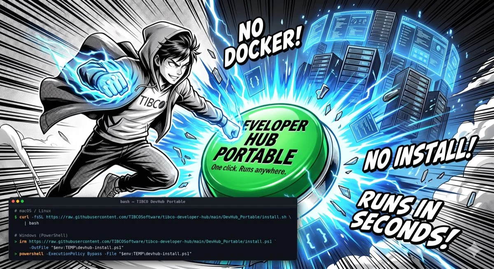

# Run the Developer Hub Portable



**DevHub Portable** runs the full TIBCO® Developer Hub — UI and API — on your own machine with a
single command. No Docker, no Postgres, no install wizard: it is a self-contained download that
starts the hub on `http://localhost:7007`.

This tutorial walks through it end to end:

1. install and start the hub with one command,
2. choose which of the two builds you need,
3. pick a different port,
4. load your own catalog,
5. understand where your data lives and how to reset it,
6. add a GitHub token, and
7. fix the handful of things that can go wrong.

## 1. Install and run

Open a terminal in the folder where you want the hub to live, then run the line for your
operating system. It downloads the right build for your machine, unpacks it, and starts the hub.

### macOS / Linux

```bash
curl -fsSL https://raw.githubusercontent.com/TIBCOSoftware/tibco-developer-hub/main/DevHub_Portable/install.sh | bash
```

### Windows (PowerShell)

```powershell
irm https://raw.githubusercontent.com/TIBCOSoftware/tibco-developer-hub/main/DevHub_Portable/install.ps1 -OutFile "$env:TEMP\devhub-install.ps1"
powershell -ExecutionPolicy Bypass -File "$env:TEMP\devhub-install.ps1"
```

When it finishes you will see `Listening on 127.0.0.1:7007`. Open
**[http://localhost:7007](http://localhost:7007)** in your browser and sign in as **Guest**.

The first launch loads a small example catalog from GitHub, so give it a few seconds before the
catalog fills up.

To stop the hub, press **Ctrl-C** in the terminal. To start it again later, re-run the same
command — it relaunches the copy you already downloaded rather than downloading it again.

## 2. Choose your build: standard or self-contained TechDocs

There are two downloads. Which one you want depends on whether you need **TechDocs pages** —
the rendered documentation pages in the hub — to work.

| Build | When to use it | TechDocs requirements | Download size |
|---|---|---|---|
| **Standard** (`devhub-bundled-<os>-<arch>.zip`) | The default. Everything works except that rendering a TechDocs page needs Python. | The first time you open a docs page, the launcher builds a small Python environment for `mkdocs`. Needs **Python 3 already installed** and **one-time internet access**. | Smaller |
| **Self-contained TechDocs** (`devhub-bundled-techdocs-<os>-<arch>.zip`) | You want docs to just work, including on a machine with **no Python** or **no internet**. | None — a private Python and `mkdocs` runtime is bundled inside. | ~60 MB larger |

The builds are otherwise identical. The standard build starts and runs fine without Python; only
the TechDocs pages are affected.

To install the self-contained TechDocs build, set `DEVHUB_TECHDOCS=1`:

```bash
# macOS / Linux
curl -fsSL https://raw.githubusercontent.com/TIBCOSoftware/tibco-developer-hub/main/DevHub_Portable/install.sh | DEVHUB_TECHDOCS=1 bash
```

```powershell
# Windows
$env:DEVHUB_TECHDOCS = "1"
powershell -ExecutionPolicy Bypass -File "$env:TEMP\devhub-install.ps1"
```

## 3. Choose a port

The hub uses port **7007** by default. If that port is already busy it automatically picks the
next free one and tells you which — read the startup log rather than assuming 7007.

To set the port yourself at install time:

```bash
# macOS / Linux
curl -fsSL https://raw.githubusercontent.com/TIBCOSoftware/tibco-developer-hub/main/DevHub_Portable/install.sh | bash -s -- --port 8088
```

```powershell
# Windows
powershell -ExecutionPolicy Bypass -File "$env:TEMP\devhub-install.ps1" -Port 8088
```

If you have already downloaded the hub, run the launcher inside the extracted folder directly:

```bash
# macOS / Linux  (folder: ./devhub-bundled-<os>-<arch>/)
./devhub --port 8088
```

```bat
:: Windows  (folder: .\devhub-bundled-win32-x64\)
devhub.cmd --port 8088
```

## 4. Load your own catalog

Out of the box the hub shows a small example catalog. To point it at your own entities, create a
small YAML file and pass it with `--config`:

```yaml
# my.yaml
catalog:
  locations:
    - type: file
      target: /absolute/path/to/catalog-info.yaml
    - type: url
      target: https://github.com/acme/repo/blob/main/catalog-info.yaml
```

```bash
./devhub --config ./my.yaml
```

You can pass `--config` more than once. The same flag accepts anything valid in a Backstage
`app-config` — integrations, auth providers, and so on — layered on top of the built-in portable
config. That makes it the hook for most customization you will want to do.

## 5. Data and resetting

Everything you create — the catalog database and the scaffolder workspace — is stored in a
**`data/`** folder next to the launcher, and it **survives restarts**.

To start completely fresh, stop the hub and delete that `data/` folder.

## 6. Optional: add a GitHub token

Without a token, GitHub features work anonymously and are rate-limited to 60 requests per hour.
Setting a token lifts that limit and enables catalog imports and scaffolder publishing.

Set it before launching:

```bash
# macOS / Linux
export GITHUB_TOKEN=ghp_xxxxxxxxxxxxxxxx
./devhub
```

```powershell
# Windows
$env:GITHUB_TOKEN = "ghp_xxxxxxxxxxxxxxxx"
.\devhub.cmd
```

## 7. Troubleshooting

| Symptom | Fix |
|---|---|
| **macOS: "devhub" cannot be opened / developer cannot be verified** | The download was quarantined. The install script clears this automatically; if you extracted manually, run `xattr -cr .` inside the folder, then `./devhub`. |
| **Windows: running a `.ps1` is blocked** | Use the `powershell -ExecutionPolicy Bypass -File …` form shown above — it is already in the one-liner. |
| **"Port 7007 is in use"** | The launcher auto-picks the next free port and prints it — open the URL it shows. Or pass `--port <n>` yourself. |
| **A TechDocs page will not render** (`spawn mkdocs ENOENT`) | The **standard** build renders docs via `mkdocs`, which needs **Python 3** installed and internet access the first time (the launcher sets it up into a local `.venv`). If you have no Python — or want zero setup — use the **self-contained TechDocs** build instead (`DEVHUB_TECHDOCS=1`, see section 2). To skip TechDocs setup entirely, set `DEVHUB_SKIP_TECHDOCS=1`. The hub runs fine either way; only the docs page is affected. |
| **The page will not load at `localhost`** | Make sure you opened the exact port from the startup log (`Listening on 127.0.0.1:<port>`), and that the terminal is still running. |
| **`curl` or `unzip` not found (Linux)** | Install them, for example `sudo apt-get install -y curl unzip`. |

## Manual download (no script)

Prefer to grab the file yourself? Go to the project's
**[Releases](https://github.com/TIBCOSoftware/tibco-developer-hub/releases)** and download the zip
for your machine — either `devhub-bundled-<your-os>-<arch>.zip` (standard) or
`devhub-bundled-techdocs-<your-os>-<arch>.zip` (self-contained TechDocs, see section 2). Unzip it
and run the launcher inside:

- macOS / Linux: `./devhub`
- Windows: double-click `devhub.cmd`, or run it from a terminal

On macOS, if it is blocked, run `xattr -cr .` in the folder first.

## What next?

You now have a local Developer Hub. Good next steps:

- Browse the **Marketplace** and get a few entries to fill out your hub.
- Follow the **[Template Tutorial](/docs/default/System/create-template)** to scaffold new
  applications from a form.
- Follow the **[Import Flow Tutorial](/docs/default/System/create-import-flows)** to bring
  existing repositories into the catalog.
- Follow the **[Self Service Flow Tutorial](/docs/default/System/create-self-service-flows)** to
  drive the TIBCO Platform from the hub.

That is it — one download, one command, and you have a local TIBCO Developer Hub.
