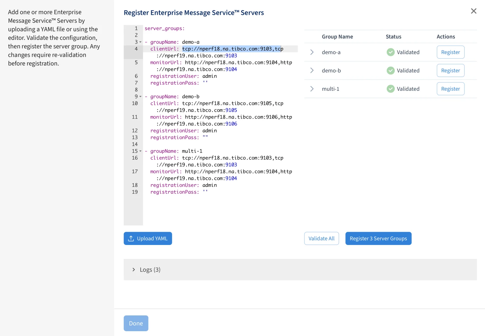
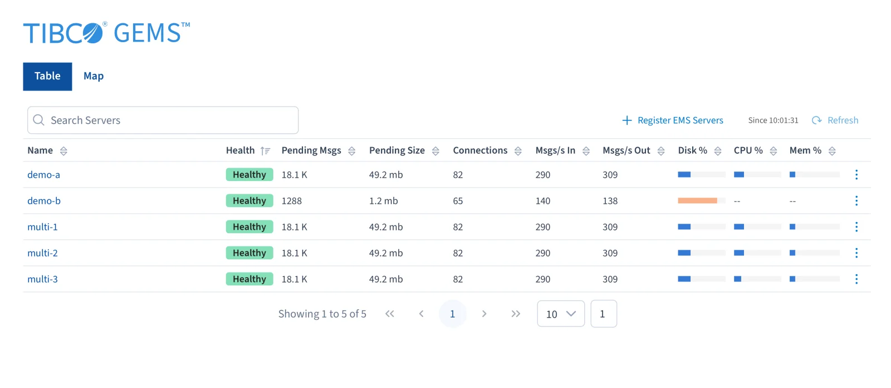

# Register EMS servers

Registration is how GEMS learns about your EMS servers. You do it from the UI — **Register EMS
Servers** on the home page — but what you supply is a YAML document, which you can write in the
editor on that page or paste in whole. Servers are registered in **groups**, never individually.



## Before you start

Two things must be true of every EMS server you are about to register.

**`monitor_listen` must be set in `tibemsd`.** GEMS validates the monitor URL as part of
registration; without the parameter there is nothing listening and validation fails.

**Enabling the `statistics` parameter is recommended.** You can turn it on from the GEMS UI after
registration, so it is not a blocker — but without it the monitoring application has much less to
collect.

!!! warning "Registration creates an account on each server"
    Registering a group creates an administrative user account and group on **every server in the
    group**. The `registrationUser` / `registrationPass` you supply is used only during registration;
    every GEMS operation afterwards uses the account that registration created. Treat this as a
    change to your EMS servers, not a read-only connection test.

## Minimal registration

!!! note "server_groups — the minimum"
    ```yaml
    server_groups:
      - groupName: sample-group
        description: "optional description"
        clientUrl: tcp://ems1.example.com:1234,tcp://ems2.example.com:1234,tcp://ems3.example.com:1234
        monitorUrl: http://ems1.example.com:2234,http://ems2.example.com:2234,http://ems3.example.com:2234
        registrationUser: admin
        registrationPass: admin-password
    ```

| Field | Required | Description |
| --- | --- | --- |
| `groupName` | **yes** | The name the group registers under. Must be unique among all groups in this GEMS instance. |
| `description` | no | Free text. Worth filling in once you have more than two groups. |
| `clientUrl` | **yes** | Comma-separated EMS client URLs, each a full URL (protocol, host, port). Up to three: primary, secondary, standby-only. |
| `monitorUrl` | **yes** | Comma-separated monitor URLs, again full URLs. Up to three, **in the same order as `clientUrl`**. |
| `registrationUser` | **yes** | An existing user with administrative rights on every server in `clientUrl`. EMS creates `admin` at install time, which works. |
| `registrationPass` | no | The password for `registrationUser`. Omit it if that user has none. |

The ordering requirement on `monitorUrl` is the one easy thing to get wrong: entry *n* of
`monitorUrl` must be the monitor endpoint of the server at entry *n* of `clientUrl`. Mismatched
ordering can still validate — both endpoints are reachable — while attributing every server's metrics
to the wrong host.

## TLS

If the servers are configured for TLS, change the protocols. Nothing else in the document changes:

!!! note "TLS — change the protocols"
    ```yaml
        clientUrl: ssl://ems1.example.com:1234,ssl://ems2.example.com:1234,ssl://ems3.example.com:1234
        monitorUrl: https://ems1.example.com:2234,https://ems2.example.com:2234,https://ems3.example.com:2234
    ```

- `clientUrl` — `ssl://` instead of `tcp://`
- `monitorUrl` — `https://` instead of `http://`

## Mutual TLS (MTLS)

Where the servers require client certificates, add a `clientMtls` block, a `monitorMtls` block, or
both — you only need the ones whose connections actually demand MTLS.

!!! danger "Copy the certificate files first"
    Every filename in these blocks is given **without a path**, and is resolved inside
    `<data-dir>/run/certs` — where `<data-dir>` is what you passed to `gemsctl start --data-dir`.
    The files must already be in that directory **before** you register the group.

!!! note "Mutual TLS — clientMtls and monitorMtls"
    ```yaml
        clientUrl: ssl://ems1.example.com:1234,ssl://ems2.example.com:1234,ssl://ems3.example.com:1234
        clientMtls:
          certificate: client-certificate.pem
          privateKey: client-private-key.pem
          pkPassword: "client-private-key-password"
          trusted: root-certificate.pem
          verifyCertificate: true
          verifyHostname: true

        monitorUrl: https://ems1.example.com:2234,https://ems2.example.com:2234,https://ems3.example.com:2234
        monitorMtls:
          certificate: monitor-certificate.pem
          privateKey: monitor-private-key.pem
          pkPassword: "monitor-private-key-password"
          trusted: root-certificate.pem
          verifyCertificate: true
          verifyHostname: true
    ```

| Field | Required | Description |
| --- | --- | --- |
| `certificate` | **yes** | Filename of the PEM-encoded certificate used for MTLS authentication. |
| `privateKey` | **yes** | Filename of the PEM-encoded private key matching that certificate. |
| `pkPassword` | no | Password for the private key. Omit when the key is not password-protected. |
| `trusted` | no | Filename of the trusted root certificate used to verify the server. Several can be given, comma-separated. |
| `verifyCertificate` | no | GEMS verifies the server certificate against `trusted` when this is `true` **or** when `trusted` is present. Set it to `false` to suppress verification even with `trusted` set. |
| `verifyHostname` | no | When `true`, and while verifying the certificate, checks the certificate CN/SAN against the hostname in `clientUrl` / `monitorUrl`. |

Two easy mistakes:

- **MTLS needs the secure protocols too.** `clientUrl` must use `ssl://` and `monitorUrl` must use
  `https://`, or the MTLS blocks do nothing.
- **`verifyCertificate` defaults on when `trusted` is present.** Adding `trusted` for documentation
  purposes silently turns verification on. If you want the root recorded but verification off, set
  `verifyCertificate: false` explicitly.

## Registering several groups at once

`server_groups` is a list, so one document can register many groups — and they need not be configured
alike. Here `sample-group-1` is plain TCP and `sample-group-2` is full MTLS:

!!! note "Two groups, one plain and one MTLS"
    ```yaml
    server_groups:
      - groupName: sample-group-1
        description: "Group 1"
        clientUrl: tcp://ems1.example.com:1234,tcp://ems2.example.com:1234,tcp://ems3.example.com:1234
        monitorUrl: http://ems1.example.com:2234,http://ems2.example.com:2234,http://ems3.example.com:2234
        registrationUser: admin
        registrationPass: admin-password

      - groupName: sample-group-2
        description: "Group 2"
        clientUrl: ssl://ems4.example.com:1234,ssl://ems5.example.com:1234
        monitorUrl: https://ems4.example.com:2234,https://ems5.example.com:2234
        registrationUser: admin
        registrationPass: admin-password
        clientMtls:
          certificate: client.cert.pem
          privateKey: client.key.pem
          pkPassword: password
          trusted: root-certificate.pem
          verifyCertificate: true
          verifyHostname: true
        monitorMtls:
          certificate: client.cert.pem
          privateKey: client.key.pem
          pkPassword: password
          trusted: root-certificate.pem
          verifyCertificate: true
          verifyHostname: true
    ```

## Validating

As soon as the YAML parses, the UI detects each group in it and offers to validate them —
individually, or all at once with **Validate all**. Validation is a quick check that the servers are
reachable and the credentials work; GEMS confirms it can reach both the `clientUrl` **and** the
`monitorUrl` of every server before it will complete registration.

Press **Done** to return to the home page, which then lists every registered server.



If validation fails, work through these in order:

| Symptom | Usual cause |
| --- | --- |
| Client URL unreachable | Wrong port, or `tcp://` where the server expects `ssl://` |
| Monitor URL unreachable | `monitor_listen` not set in `tibemsd`, or the wrong monitor port |
| Credentials rejected | `registrationUser` does not exist on *every* server in the group, or lacks administrative rights |
| MTLS handshake fails | Certificate files not copied into `<data-dir>/run/certs`, a path given instead of a bare filename, or `verifyHostname` against a certificate whose CN/SAN does not match the URL |

---

Source: [TIBCO GEMS 1.1.0 documentation](https://docs.tibco.com/pub/msg-gems/1.1.0/doc/html/).
