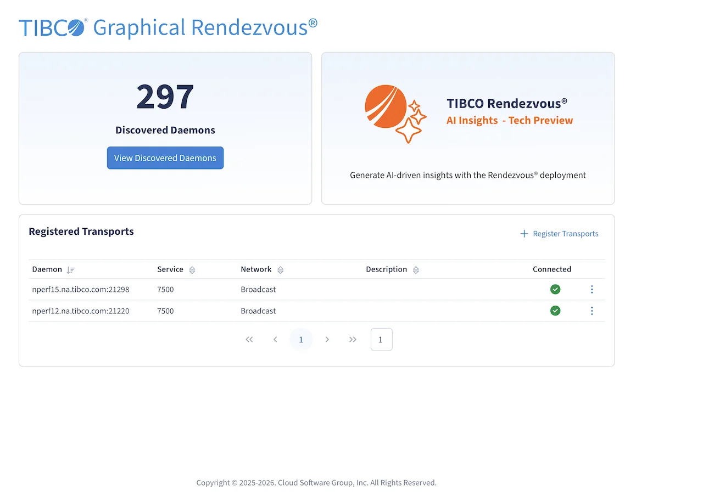

# Install and run

## 1. Download and extract

Download the Graphical Rendezvous package for your platform from the TIBCO download site, then
extract it. Everything you need is inside the archive — there is no installer.

!!! note "Linux and Windows"
    ```sh
    # Linux
    unzip TIB_grv_1.1.0_linux_x86_64.zip

    # Windows
    powershell.exe Expand-Archive -Path .\TIB_grv_1.1.0_win_x86_64.zip -DestinationPath .
    ```

Run every command below **from the extracted package directory**. `grvctl` looks for the image file
relative to where it runs.

## 2. Start Graphical Rendezvous

!!! note "Linux and Windows"
    ```sh
    bin/grvctl start          # Linux
    bin\grvctl.exe start      # Windows
    ```

One command does the lot: it loads the container image, creates and starts the container, and opens
the UI in your default browser if your platform has one. On a headless host add `--no-browser` and
open `http://<host>:7580/` yourself.


That landing page is where every registration starts — the **Register Transports** button on it is
step 4 below.

### How `grvctl` finds the image

This is the step that surprises people, so it is worth knowing the order:

1. It searches the **current working directory and its parent** for the packaged image file
   (`TIB_grv_1.1.0_linux_x86_64.zst`) and loads what it finds.
2. Failing that, it uses the image named in `container.imageName` from the local registry.

Two flags override the search, and they are mutually exclusive:

- `--image-file <path>` — load this specific image file.
- `--image <name>` — use this image name from the local registry.

If you keep several Graphical Rendezvous versions side by side, pass `--image-file` explicitly
rather than trusting the search to pick what you meant.

### Where things are written

| | Default |
| --- | --- |
| Data directory | `$HOME/.grv` (Linux), `%USERPROFILE%\.grv` (Windows) — override with `--data-dir` |
| UI port | `7580` — override with `--port` |
| Configuration file | `.grvconfig` in the current working directory — override with `--config` |

The data directory holds the Prometheus time series, the component logs and the run state, so point
`--data-dir` at a volume with room to grow if you intend to keep history.

## 3. Secure the UI before anyone else uses it

Started as above, the Graphical Rendezvous port is plain HTTP with no authentication. To lock it
down, create a `.grvconfig` file with a `security` section. Two rules:

- Basic authentication requires a **password hash**, not a password.
- If you configure `basicAuth`, you **must** also configure `tls` — otherwise you would be sending
  credentials in the clear.

Generate the hash first:

!!! note "Generate the password hash"
    ```sh
    bin/grvctl hash-pwd 'the-password-you-want'
    ```

It prints the hash to the console. Paste that into the configuration file:

!!! note ".grvconfig — basic authentication and TLS"
    ```yaml
    security:
      basicAuth:
        userName: grv-admin
        password: JDEkUi5wU01wMXpUOEVnWVpERGlPckZiSE9kcmRhczBCbFAkXKThc6Txlh5pFikn+5IwkJ6qauv+1kNxFZJpNOzQ/8I=
      tls:
        cert: /path/to/cert.pem
        key: /path/to/key.pem
    ```

Restart Graphical Rendezvous to pick the change up, and the UI is then served over HTTPS behind
basic authentication.

Securing the UI is separate from how Graphical Rendezvous verifies *daemon* certificates — that is
the `security.rv` block, covered in the [grvctl reference](grvctl.md#security).

## 4. Register your transports

The first screen offers a **Register Transports** button. What you supply there is a YAML document,
written in the editor built into the page or uploaded as a file — covered in full on
[Register transports](register-transports.md).

Once the transports validate, **Done** returns you to the home page, which lists every discovered
daemon.



## 5. Stop Graphical Rendezvous

!!! note "Linux and Windows"
    ```sh
    bin/grvctl stop           # Linux
    bin\grvctl.exe stop       # Windows
    ```

Stopping leaves the data directory, image and container in place, so the next `start` is fast and
your Prometheus history survives.

!!! warning "`--cleanup` is destructive"
    `bin/grvctl stop --cleanup` removes the stopped containers and deletes the run state directory.
    Use it to reclaim a machine, not as a normal shutdown — and never set `cleanup: true` in
    `.grvconfig`, which would make **every** `stop` destructive.

## 6. Upgrade

Upgrading is a stop, an extract and a start — in that order, from the new directory:

!!! note "Upgrade — stop, extract, start from the new directory"
    ```sh
    bin/grvctl stop                        # 1. stop; the data directory is preserved
    unzip TIB_grv_1.1.0_linux_x86_64.zip   # 2. extract the new package
    bin/grvctl start                       # 3. start from the NEW directory
    ```

Step 3 must run from the newly extracted directory: that is what makes `grvctl` load the new image
and create a new container from it. Starting from the old directory quietly brings the old version
back up. Your Prometheus data, logs and configuration in the data directory carry over untouched —
just do not pass `--cleanup` to the `stop` in step 1.

## Repeatable runs

Passing the same flags every time gets old. Put them in `.grvconfig` instead and both `start` and
`stop` will pick them up:

!!! note ".grvconfig — repeatable runs"
    ```yaml
    global:
      dataDir: ./grv-data
      noBrowser: true
    container:
      port: 8080
    ```

Keep that file next to the extracted package, or point at it with `--config` from anywhere. The full
set of settings is in the [grvctl reference](grvctl.md#configuration-file).

---

Source: [TIBCO Graphical Rendezvous 1.1.0 documentation](https://docs.tibco.com/pub/grv/1.1.0/doc/html/).
