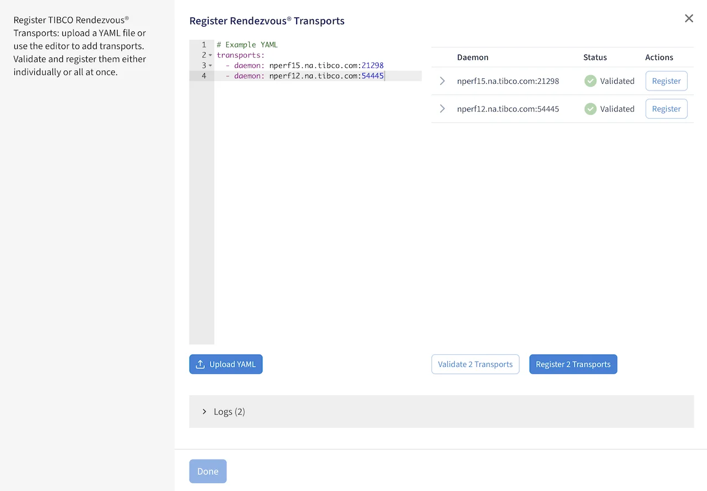

# Register transports

Registration is how Graphical Rendezvous learns about your Rendezvous estate. You do it from the UI
— **Register Transports** on the home page — but what you supply is a YAML document, which you can
write in the editor on that page, paste in whole, or upload as a prepared file.

You register **transports**, not daemons. Each transport is a Rendezvous transport specification;
Graphical Rendezvous connects through it and discovers the daemons it can see from there.



## Minimal registration

Only the daemon address is required. Everything else is optional:

!!! note "transports — the minimum"
    ```yaml
    transports:
      - daemon: "10.162.221.37:7500"
        service: "20000"          # Optional
        network: ";239.255.0.1"   # Optional
        description: "Front office"  # Optional
    ```

| Field | Required | Description |
| --- | --- | --- |
| `daemon` | **yes** | The `daemon` parameter of the Rendezvous transport specification. |
| `service` | no | The `service` parameter of the Rendezvous transport specification. |
| `network` | no | The `network` parameter of the Rendezvous transport specification. |
| `description` | no | Free text. The transport appears in the UI as a client with this description. |

`description` is optional in the way `groupName` is not — but it is the only thing that tells one
transport from another once you have more than two, and it is what shows on the daemon as the client
name. Fill it in.

## Registering several transports at once

`transports` is a list, so one document can register a transport per network or location:

!!! note "Two transports in one document"
    ```yaml
    transports:
      - daemon: "10.162.221.37:7500"
        service: "20000"
        network: ";239.255.0.1"
        description: "Front office"
      - daemon: "10.162.221.37:7500"
        service: "20001"
        network: ";239.255.0.1"
        description: "Back office"
    ```

Registration is **not** all-or-nothing: valid transports register regardless of whether others in
the same list fail validation. So a document with one bad daemon address still gets you the rest of
the estate — fix the failure and resubmit just that one.

## Routing daemons under basic authentication

If basic authentication is enabled on a Rendezvous routing daemon, Graphical Rendezvous needs
credentials before it can let you modify that daemon's router configuration. They come from two
environment variables, not from the registration YAML:

| Variable | Description |
| --- | --- |
| `TIBRVMON_RV_ADMIN_NAME` | Admin user name for daemons with basic authentication enabled |
| `TIBRVMON_RV_ADMIN_PASSWORD` | The plaintext password for that user |

Set them before `grvctl start` — they are read by `tibrvmon` inside the container, so a running
instance will not pick up a change. Without them, a routing daemon still gets discovered and
monitored; you just cannot configure it from the UI.

!!! info "Configuration is not immediately available"
    It can take up to **90 seconds** after a routing daemon is discovered before you can modify its
    configuration. A greyed-out control on a daemon you have only just registered is usually this,
    not a permissions problem.

## Dynamic transports

Graphical Rendezvous creates transports of its own that you never configured. These are **dynamic
transports**, and they exist to drive the automatic discovery process.

They behave differently from the ones you register:

- They **do not persist across restarts**.
- They are **hidden in the UI** — but they still count as client connections and contribute to the
  statistics you see on a daemon.
- Graphical Rendezvous deletes them automatically if you delete the transport that discovered them,
  or if a dynamic transport would conflict with an existing one.
- A dynamic transport you deleted can come back, if the same route is rediscovered.

The practical consequence: do not go hunting for the extra client connections on a busy daemon, and
do not treat the connection count as a count of your own applications. If you would rather not have
them at all, set `rvmon.disableDynamicTransports: true` in `.grvconfig` — at the cost of the
automatic discovery they provide.

## Validating

As soon as the YAML parses, the UI detects each transport in it and offers to validate them —
individually, or all at once. Validation checks that the definition is syntactically correct and
that Graphical Rendezvous can actually connect to the specified daemon before it completes
registration.

Press **Done** to return to the home page, where all discovered daemons are shown.

If validation fails, work through these in order:

| Symptom | Usual cause |
| --- | --- |
| Daemon unreachable | The Rendezvous daemon is not running, or is not reachable from the host running the `grv` container — check the address and port in `daemon` |
| Argument conflict | The `service` / `network` combination collides with an already registered transport. Conflicts can take up to the daemon's multicast reliability window to resolve, after which the responsible transport is deleted — so wait that window out before concluding the registration worked |
| Registers, but nothing appears | The transport is valid but sees no daemons from where it sits; check `network` against the multicast group the estate actually uses |
| Cannot change a router's configuration | `TIBRVMON_RV_ADMIN_NAME` / `TIBRVMON_RV_ADMIN_PASSWORD` not set before `grvctl start`, or the daemon was discovered less than 90 seconds ago |

---

Source: [TIBCO Graphical Rendezvous 1.1.0 documentation](https://docs.tibco.com/pub/grv/1.1.0/doc/html/).
