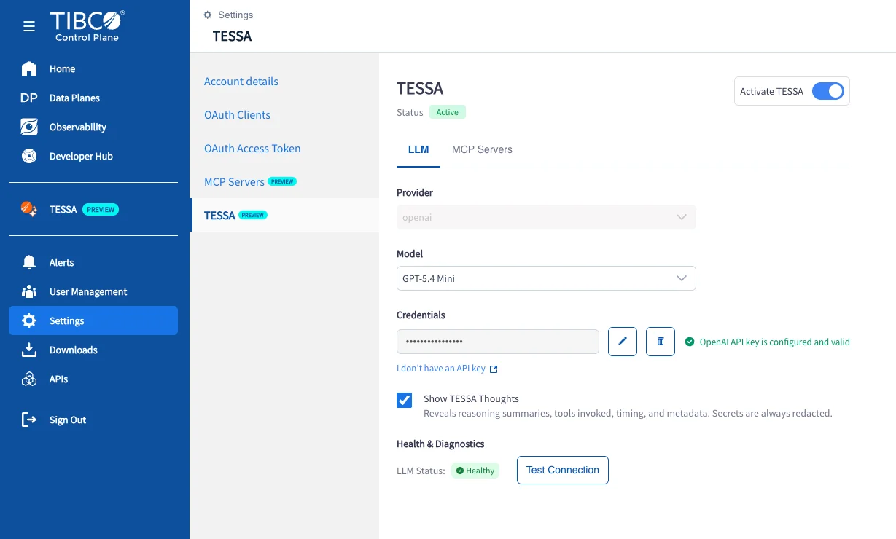
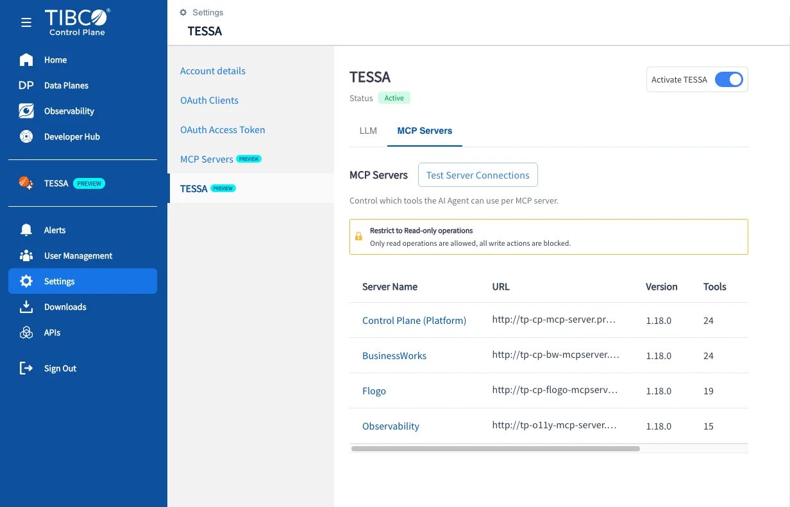
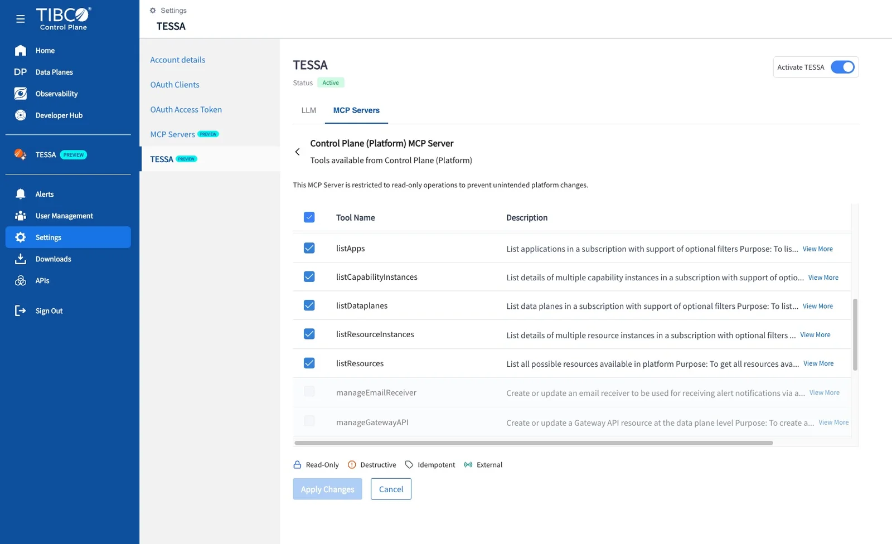
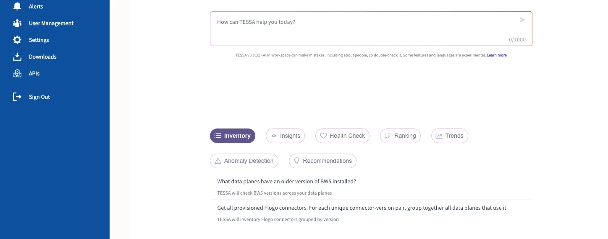

# Set Up TESSA

TESSA is configured once, per subscription, from the TIBCO Control Plane. You need two things: a model
provider with a valid API key, and at least one MCP server connected.

!!! warning "TESSA is a preview capability"
    TESSA appears in the Control Plane with a **PREVIEW** badge. Screens and options shown here may
    differ slightly from the build in your environment.

---

## Prerequisites

| Requirement | Details |
| :---- | :---- |
| **Subscription access** | Permission to open **Settings** in the TIBCO Control Plane |
| **Model provider API key** | A valid key for a supported provider, entered during setup |

---

## Step 1: Activate TESSA and configure the model

Go to **Settings → TESSA**, then turn on **Activate TESSA**. The status should read **Active**.

On the **LLM** tab:

* Choose your **Provider**.
* Choose a **Model** from the list available for that provider.
* Paste your API key into **Credentials**. TESSA validates it and confirms the key is configured and
  valid.
* Optionally enable **Show TESSA Thoughts** — see the tip below.
* Click **Test Connection** and confirm **LLM Status** shows **Healthy**.

!!! tip "Turn on Show TESSA Thoughts while you are learning"
    It reveals reasoning summaries, which tools were invoked, timing and metadata — secrets are always
    redacted. It is the fastest way to understand why a prompt did or did not work, and which MCP
    server answered it. Once you are comfortable, turn it off for a cleaner conversation.

---

## Step 2: Review the connected MCP servers

Switch to the **MCP Servers** tab. This is where TESSA's abilities actually come from — each server
contributes a set of tools, and the agent picks between them.

A typical configuration connects four servers:

| Server | What it lets TESSA answer |
| :---- | :---- |
| **Control Plane (Platform)** | Applications, data planes, capability instances, resources, provisioning |
| **BusinessWorks** | BusinessWorks application detail |
| **Flogo** | Flogo application and connector detail |
| **Observability** | Metrics, charts and health scoring |

Click **Test Server Connections** to confirm all of them respond.

!!! info "Restrict to Read-only operations"
    The banner on this tab is the guarantee that makes TESSA safe to point at production: only read
    operations are permitted, and every write action is blocked. This is why prompts in this library
    never ask TESSA to change anything.

---

## Step 3: Control which tools TESSA may use

Click a server name to see the tools it exposes and enable or disable them individually.

Read-only tools such as `listApps`, `listDataplanes` and `listResources` are enabled. Tools that would
change the platform — `manageEmailReceiver`, `manageGatewayAPI` and similar — are greyed out and
cannot be selected while the read-only restriction is in force.

The legend at the bottom marks each tool as **Read-Only**, **Destructive**, **Idempotent** or
**External**. If you disable a tool here, prompts that depend on it will stop working, and TESSA will
tell you it cannot answer rather than guessing — so if a prompt from this library fails, this screen
is the first place to check.

Click **Apply Changes** to save.

---

## Step 4: Open TESSA and ask something

Select **TESSA** in the left-hand navigation to open the conversation.

The home screen suggests prompts grouped into categories — **Inventory**, **Insights**,
**Health Check**, **Ranking**, **Trends**, **Anomaly Detection** and **Recommendations**. These are a
good sanity check that everything is wired up, and this library is organised along broadly the same
lines.

Type `help` as your first message. TESSA answers immediately with an overview of what it can currently
do, without calling any tools — which also confirms the model connection is working.

---

## You are all set

Head to [Inventory and Discovery](inventory.md) to find the real application and data plane names in
your environment, then work through whichever page matches what you need.

---

## Quick reference

| Step | Action | Location |
| :---- | :---- | :---- |
| 1 | Activate TESSA, select provider and model, enter API key | Settings → TESSA → LLM |
| 2 | Test the connection | Settings → TESSA → LLM → Test Connection |
| 3 | Review connected servers and the read-only restriction | Settings → TESSA → MCP Servers |
| 4 | Enable or disable individual tools | Settings → TESSA → MCP Servers → *server name* |
| 5 | Open the conversation and send `help` | TESSA (left-hand navigation) |
